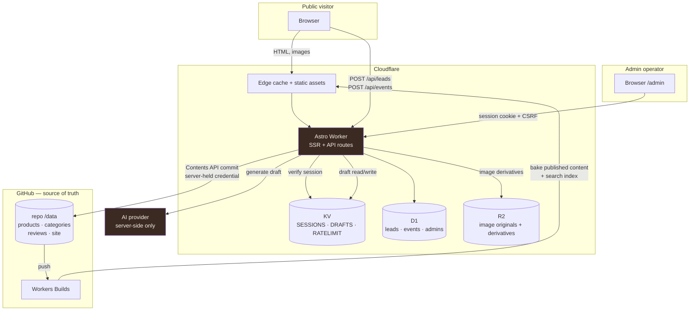
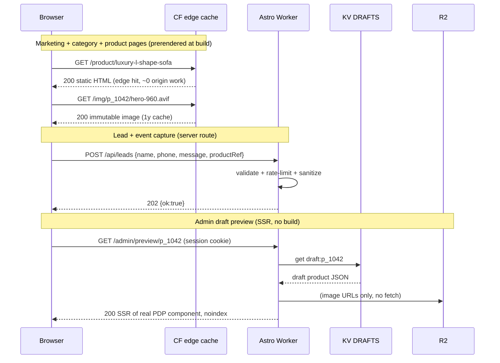
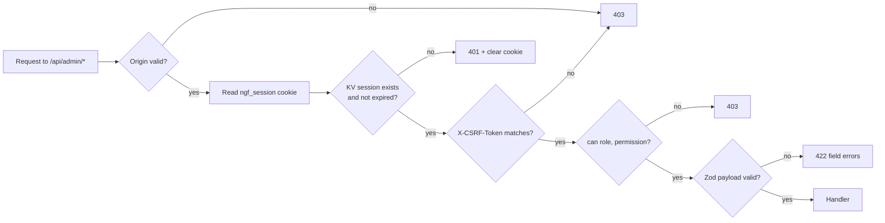
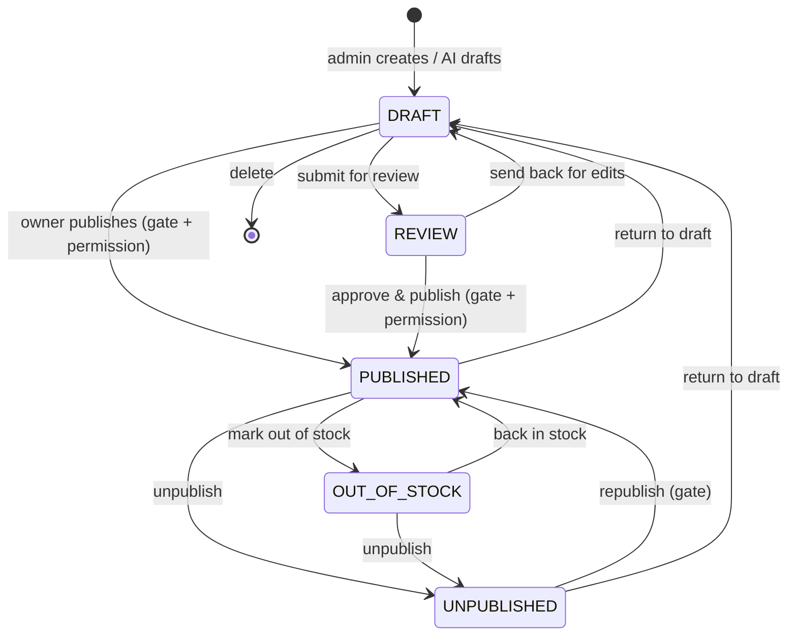
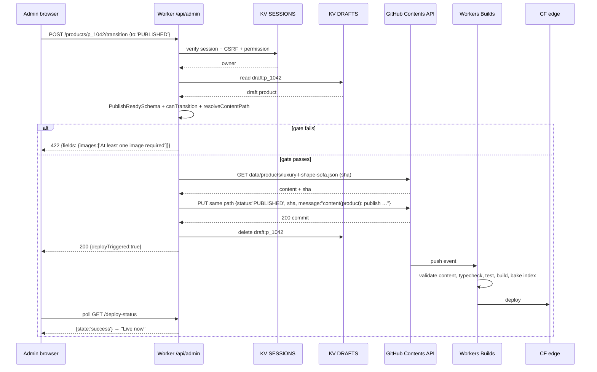
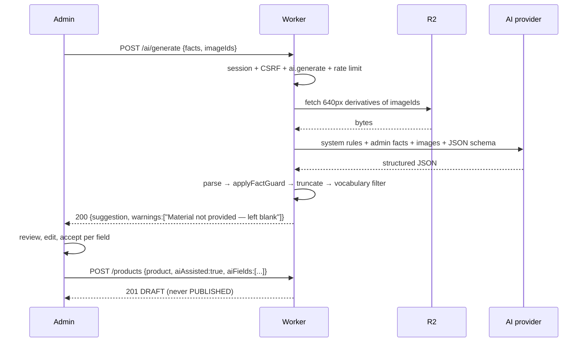

# Design Document: New Galaxy Furniture Website

---

## Overview

New Galaxy Furniture (NGF) is a Bengaluru-based furniture manufacturer and showroom serving Karnataka. This design specifies a greenfield premium catalogue website whose single business purpose is to convert browsing into WhatsApp enquiries and phone calls — there is no cart, no checkout, and no customer accounts. The public site is a fast, editorial, motion-rich furniture catalogue; behind it sits a serious internal admin system where a non-technical operator creates and publishes products.

The architecture is **GitHub-as-source-of-truth, Cloudflare-as-runtime**. Structured content lives as validated JSON files under `/data` in this repository; the admin dashboard never writes to a database of record — it writes commits to GitHub through a server-side Cloudflare Worker endpoint that holds the only GitHub credential. Each content commit that changes published state triggers a Cloudflare build, which bakes the catalogue into the deployed bundle. Public page reads therefore touch **no** database and **no** GitHub API at request time, which is what makes the Core Web Vitals targets achievable. Draft and in-review content bypasses the build entirely and is served from Cloudflare KV so that admin preview is instant.

Three characteristics drive most of the decisions below: (1) the content set is small and slow-changing (tens to low hundreds of products), which makes build-time baking dramatically cheaper and faster than runtime data fetching; (2) motion is a first-class product requirement, not decoration, so the motion system is designed as a token-driven reusable SVG component library with a hard JS budget rather than an animation library sprinkled on top; (3) the operator will supply real content later, so every place where facts are unknown gets a marked placeholder and an admin-editable field rather than an invented claim.

### Non-Goals

- No shopping cart, checkout, payment, or customer accounts (explicitly out of scope; the conversion endpoint is WhatsApp/phone).
- No Supabase or any third-party BaaS.
- No fabricated business facts, metrics, credentials, or policy text anywhere in the delivered site.
- No production domain hard-coded anywhere (the domain is purchased later).

---

## Technology Decisions

Each decision below is binding for implementation. Where a credible alternative exists it is named with the reason it lost.

| Concern | Decision | Rationale | Rejected alternative |
|---|---|---|---|
| Framework | **Astro 7** with React 19 islands | Per-route `prerender` control lets marketing pages ship ~zero JS while `/admin` runs a full React app in the same codebase. Astro's Content Layer + Zod gives the canonical product schema and its runtime validator as one artifact. Astro 5 was additionally rejected on security: every 5.x release carries unpatched high-severity XSS advisories with no patched 5.x available, so 5.x is not a shippable line regardless of its feature parity. | Next.js on Cloudflare (heavier adapter surface, ships React runtime to every marketing page); React Router v7 framework mode (uniform SSR is a poor fit for 20+ static content pages) |
| Runtime / host | **Cloudflare Workers** via `@astrojs/cloudflare` adapter, deployed by Workers Builds from GitHub | Required by the brief. Static assets served from Cloudflare's edge asset store; server routes run as Worker handlers in the same deployment. | Cloudflare Pages Functions (Workers Builds is the current, non-legacy path) |
| UI styling | **Tailwind CSS v4** with design tokens defined as CSS custom properties in `@theme` | Token-first, zero-runtime, tree-shaken; keeps the palette and motion tokens in one enforced place. | CSS-in-JS (runtime cost, conflicts with the JS budget) |
| Content store of record | **JSON files under `/data` in this Git repo** | Required. Gives free version history, code review, and rollback on content. | Any DB as source of truth |
| Published read path | **Build-time baked** into the deployment | Zero request-time I/O → best possible LCP/TTFB; no GitHub rate limits; catalogue is small. | Runtime GitHub reads (latency + 5k req/hr limit + auth on read path) |
| Draft / preview read path | **Cloudflare KV** (`DRAFTS` namespace) | Instant preview with no build wait; drafts never enter the public bundle. | Committing drafts to a preview branch (build per keystroke-ish save) |
| Sessions, rate limits, locks | **Cloudflare KV** (`SESSIONS`) + Workers Rate Limiting binding | TTL-native, globally readable, cheap. | D1 (write amplification on every request) |
| Leads + analytics | **Cloudflare D1** (SQLite) | Needs relational filtering/search for the Leads admin and date rollups for analytics; free tier is ample. | Analytics Engine only (no leads storage, no row updates for lead status) |
| Image binaries | **Cloudflare R2** + on-upload derivative generation | Keeps the repo small so builds stay fast; no Git LFS; R2 has zero egress. | Committing images to the repo (base64 Contents API limits, repo bloat, slow builds) |
| Password hashing | **PBKDF2-HMAC-SHA-256, 600,000 iterations**, 16-byte salt, 32-byte key, via WebCrypto | The only strong KDF available natively in Workers with no WASM payload; parameters at OWASP's current PBKDF2-SHA256 guidance. | bcrypt/Argon2id via WASM (bundle weight + CPU-time risk on the login path) — revisit if login latency budget allows |
| Motion library | **`motion` (Motion One, ~5 KB gz)** for JS-driven sequences; CSS/SVG for everything else | Meets the motion brief inside the JS budget; uses the native Web Animations API. | framer-motion (~35 KB+ gz, exceeds motion budget) |
| Client search | **MiniSearch (~7 KB gz)** over a build-generated index | Fuzzy + prefix + field boosting out of the box; no server round-trip for suggestions. | Custom trigram matcher (reinvention); server search (adds latency to every keystroke) |
| Validation | **Zod** shared between build-time content validation and Worker request validation | One schema, two enforcement points; TS types inferred from it. | Hand-written validators (drift between build and runtime) |
| Testing | Vitest (unit) + **fast-check** (property) + Playwright (e2e/responsive) | Property tests are the right tool for the slug/URL/filter/permission invariants listed later. | e2e-only (misses the algebraic invariants) |

### Implemented versions

These are the versions actually installed, not floors to be resolved at install time: astro 7.2.10, @astrojs/react 6.0.5, @astrojs/cloudflare 14.2.6, React 19.2.8, Vite 8.2.2, Tailwind 4.3.3, Vitest 4.1.11, fast-check 4.9.0, Wrangler 4.128.0, Zod 4.3.6. The Zod 4 upgrade was forced, not optional: Astro 7's content layer rejects any schema lacking a Zod-v4 `_zod` marker (`astro/zod` re-exports `zod/v4`), so a v3 schema cannot serve as a collection schema at all — and deduplicating on v4 is also what makes `CollectionEntry<'products'>['data']` resolve to the inferred `Product` type instead of `any`. `.passthrough()`, `.superRefine()`, `z.string().datetime()`, `z.string().date()`, and `z.string().url()` all still work as this design writes them, though several emit v4 deprecation hints. The runtime floor is **Node ≥ 22.12.0** — local development, CI, and Workers Builds must all be on 22.12.0 or later.

### The Central Tradeoff: Publish Latency vs. Request Latency

This is the most consequential decision in the design, so it is stated explicitly.

| Strategy | Public request cost | Publish → visible | Rate-limit / cost exposure | Verdict |
|---|---|---|---|---|
| Runtime GitHub API reads | +200–600 ms per uncached page, plus auth on the read path | ~instant | GitHub 5,000 req/hr; a crawler can exhaust it | **Rejected** |
| Runtime KV/D1 read of published content | +5–40 ms per page, still a data dependency per render | ~seconds | KV read cost per request | **Rejected as the primary path** |
| Build-time baking | **0 ms** — content is in the bundle; HTML can be prerendered | **60–150 s** (one Cloudflare build) | none | **Chosen** |

The cost of baking is that a publish is not visible until a build completes. Three things make that acceptable:

1. **Publishing is a deliberate, low-frequency act.** The workflow is draft → review → approve → publish. A one-to-two-minute settle after the final click is operationally invisible.
2. **Draft iteration never waits for a build.** Every admin save writes to KV immediately; `/admin/preview/{id}` renders the real customer-facing product page component against the KV draft, server-side, on demand. The operator sees their edits in under a second.
3. **Draft-only commits do not trigger builds.** Commits that change only draft/review content carry `[skip ci]` in the commit message so Cloudflare skips the build; only publish/unpublish/delete and category/site-config commits deploy. This keeps build minutes and publish noise proportional to actual publishing.

The admin UI must **show** this honestly: after Publish, the operator sees "Publishing — live in about a minute" with a deployment status indicator polled from `/api/admin/deploy-status`, not a false "Published" success state.

---

## Architecture

### System diagram and trust boundary



**Trust boundary:** the browser — public or admin — never receives a GitHub token, AI API key, D1/R2/KV credential, or admin secret. Every privileged operation is a `POST` to a Worker route that re-derives authorization server-side from the session cookie. There are no public environment variables other than `PUBLIC_SITE_URL`, the two WhatsApp numbers, and the two phone numbers (all of which are intentionally public information printed on the site).

### Request / Render Path



Rendering mode per route:

| Route group | Mode | Why |
|---|---|---|
| `/`, `/about`, `/workshop`, `/gallery`, `/reviews`, `/custom-furniture`, `/contact`, `/faq`, `/privacy`, `/terms`, `/shipping`, `/returns`, `/warranty` | Prerendered | Content changes only on publish |
| `/collection`, `/collection/[category]` | Prerendered shell; filtering/sorting/search run client-side against a delivered dataset | Instant interaction, no server round-trip per filter click |
| `/product/[slug]` | Prerendered, one page per published product | Best LCP; every published product gets a page automatically from the collection |
| `/admin/**` | SSR (Worker), `noindex`, React island for interactive views | Must reflect draft state and enforce auth per request |
| `/api/**` | Worker handlers | Privileged / dynamic |
| `/sitemap.xml`, `/robots.txt` | Generated at build | Derived from published collections |
| `/img/**` | Worker handler with long-lived immutable cache, backed by R2 | Serves generated derivatives |

### Folder Structure

```text
/
├── data/                          # source of truth, human- and Kiro-editable
│   ├── products/{slug}.json
│   ├── categories/{slug}.json
│   ├── reviews/{id}.json
│   ├── site/
│   │   ├── settings.json          # business name, numbers, location, socials, SEO defaults
│   │   ├── homepage.json          # section copy + which sections are enabled
│   │   └── rankings.json          # manual ordering fallback for trending/best-seller/most-viewed
│   └── snapshots/
│       └── analytics.json         # build-time snapshot of D1 view/click counts (optional input)
├── src/
│   ├── content.config.ts          # Astro Content Layer collections + Zod schemas
│   ├── schemas/                   # Zod schemas shared by build and Worker
│   ├── pages/                     # routes (public, admin, api)
│   ├── components/
│   │   ├── ui/                    # buttons, chips, inputs
│   │   ├── product/               # cards, gallery, PDP blocks
│   │   ├── motion/                # the animated 2D SVG component set
│   │   └── admin/                 # React island components
│   ├── lib/
│   │   ├── github/                # commit pipeline, path allowlist
│   │   ├── auth/                  # KDF, sessions, CSRF, rate limit
│   │   ├── ai/                    # provider-agnostic assistant
│   │   ├── images/                # upload validation + derivative generation
│   │   ├── search/                # index build + query
│   │   ├── whatsapp.ts            # message + URL construction
│   │   ├── slug.ts                # slug/SKU generation + uniqueness
│   │   └── analytics/             # event write + rollup queries
│   └── styles/tokens.css          # palette, type scale, motion tokens
├── public/
│   ├── brand/                     # logo slot (see Open Items)
│   └── .assetsignore              # second line of defence against uploading server artifacts
├── dist/                          # build output, generated, git-ignored
│   ├── client/                    # public static assets — the only tree uploaded to the asset store
│   └── server/                    # the Worker bundle — never publicly reachable
├── scripts/
│   ├── add-product.ts             # CLI used by the Kiro product workflow
│   └── validate-content.ts        # schema gate, runs in CI and pre-build
├── tests/{unit,property,e2e}/
├── .env.example
└── wrangler.toml
```

**Bindings** (`wrangler.toml`): `SESSIONS` (KV), `DRAFTS` (KV), `RATELIMIT` (KV + Rate Limiting binding), `DB` (D1), `MEDIA` (R2), and secrets `GITHUB_TOKEN`, `GITHUB_REPO`, `GITHUB_BRANCH`, `AI_PROVIDER`, `AI_API_KEY`, `AI_MODEL`, `SESSION_SECRET`, `CF_DEPLOY_HOOK_URL` (optional). `.env.example` lists every name with placeholder values and no real secrets.

**Build output layout and asset exposure.** The adapter splits the build into two sibling trees: `dist/client/**` holds the public static assets that are uploaded to Cloudflare's asset store, and `dist/server/**` holds the Worker bundle, which is never publicly reachable. There is no single flat `dist/` containing the worker alongside the assets, and no `dist/_worker.js/**` — anything written against that older layout is wrong. Accordingly, `[assets] directory` in `wrangler.toml` points at **`./dist/client`** specifically, not at `./dist`, so the server bundle sits *structurally* outside the uploaded asset tree rather than inside it awaiting exclusion. `public/.assetsignore` remains in place as a second line of defence, not as the only one: the primary guarantee is the directory boundary, and the ignore file catches anything that later lands in the client tree by mistake.

---

## Data Models

### File layout rules

One product per file at `data/products/{slug}.json`, where the filename **is** the slug. This makes the slug trivially unique (the filesystem enforces it), makes a product's history a single-file `git log`, and means adding a product touches exactly one data file plus zero frontend files — satisfying the Kiro workflow requirement.

Categories are `data/categories/{slug}.json`, seeded with the nine required categories and extensible by dropping in a file. Reviews are `data/reviews/{id}.json`. Site configuration is three files under `data/site/`.

### Canonical product schema

The Zod schema is the single definition; the TypeScript type is inferred from it. It is used in three places: the Astro content collection loader (build-time gate), the admin write endpoint (request-time gate), and `scripts/validate-content.ts` (CI gate).

```ts
// src/schemas/product.ts
import { z } from 'zod';

export const ProductStatus = z.enum([
  'DRAFT', 'REVIEW', 'PUBLISHED', 'UNPUBLISHED', 'OUT_OF_STOCK',
]);
export const StockStatus = z.enum([
  'IN_STOCK', 'LIMITED_STOCK', 'OUT_OF_STOCK', 'MADE_TO_ORDER',
]);

export const ProductImage = z.object({
  id: z.string().regex(/^img_[a-z0-9]{10}$/),
  key: z.string(),                       // R2 object key of the original
  alt: z.string().max(180).default(''),
  width: z.number().int().positive(),    // intrinsic dims — required, prevents CLS
  height: z.number().int().positive(),
  order: z.number().int().nonnegative(),
  altSource: z.enum(['admin', 'ai']).default('admin'),
});

export const Dimensions = z.object({
  lengthCm: z.number().positive().optional(),
  widthCm: z.number().positive().optional(),
  heightCm: z.number().positive().optional(),
  depthCm: z.number().positive().optional(),
  display: z.string().max(120).optional(), // e.g. "7 ft × 3 ft × 2.5 ft"
}).partial();

export const ProductVariant = z.object({
  id: z.string(),
  label: z.string(),                     // "3 Seater", "Queen"
  sku: z.string().optional(),
  priceDelta: z.number().int().optional(),
  stockStatus: StockStatus.optional(),
});

export const ProductSchema = z.object({
  // identity
  id: z.string().regex(/^p_[a-z0-9]{10}$/),
  sku: z.string().regex(/^[A-Z0-9][A-Z0-9-]{2,31}$/),
  slug: z.string().regex(/^[a-z0-9]+(?:-[a-z0-9]+)*$/).max(80),

  // classification
  name: z.string().min(2).max(120),
  category: z.string(),                  // must resolve to data/categories/{slug}.json
  subcategory: z.string().optional(),
  tags: z.array(z.string()).max(24).default([]),

  // copy
  description: z.string().min(20).max(6000),
  shortDescription: z.string().max(240).optional(),

  // pricing (INR, integer paise-free rupees)
  currency: z.literal('INR').default('INR'),
  price: z.number().int().positive().nullable(),   // null ⇒ price on enquiry
  priceOnEnquiry: z.boolean().default(false),
  originalPrice: z.number().int().positive().nullable().default(null),
  discount: z.number().int().min(0).max(95).nullable().default(null), // derived, never authored freely

  // inventory
  stockStatus: StockStatus,
  madeToOrder: z.boolean().default(false),

  // attributes
  material: z.string().max(120).optional(),
  color: z.string().max(60).optional(),
  availableColors: z.array(z.string().max(60)).max(20).default([]),
  dimensions: Dimensions.optional(),
  size: z.string().max(60).optional(),
  variants: z.array(ProductVariant).max(20).default([]),
  customization: z.string().max(2000).optional(),
  deliveryInformation: z.string().max(2000).optional(),

  // media
  images: z.array(ProductImage).max(20).default([]),
  primaryImage: z.string().optional(),   // ProductImage.id; defaults to lowest order
  imageAltText: z.string().max(180).optional(), // legacy/simple alt for OG image

  // merchandising
  featured: z.boolean().default(false),
  trending: z.boolean().default(false),
  bestSeller: z.boolean().default(false),
  newArrival: z.boolean().default(false),
  relatedProductIds: z.array(z.string()).max(12).default([]),

  // lifecycle
  status: ProductStatus,
  published: z.boolean().default(false),  // derived mirror of status, see invariants

  // SEO
  seoTitle: z.string().max(70).optional(),
  seoDescription: z.string().max(170).optional(),
  keywords: z.array(z.string()).max(20).default([]),

  // provenance
  createdAt: z.string().datetime(),
  updatedAt: z.string().datetime(),
  aiAssisted: z.boolean().default(false),
  aiFields: z.array(z.string()).default([]), // field paths whose value originated from AI
})
  .passthrough()      // ← unknown-field tolerance: extra keys are preserved, never dropped
  .superRefine(enforceProductInvariants);

export type Product = z.infer<typeof ProductSchema>;
```

**Typing arrangement.** Written literally as above — `ProductSchema = z.object({…}).passthrough().superRefine(enforceProductInvariants)` with `enforceProductInvariants(p: Product, …)` — this is a circular type reference: `Product` is inferred from the schema, and the schema references a function annotated with `Product`. The implementation therefore names the object schema separately and types the invariant function against that object's output. The field list, the invariants, and the messages are all unchanged; this is a typing arrangement, not a semantic change.

**Unknown-field tolerance.** `.passthrough()` means a product file authored by a future version of the schema (or by a human adding a field by hand) validates and round-trips: the write pipeline reads the raw JSON, merges the changed fields, and re-serializes, so unrecognized keys survive edits instead of being silently deleted. The frontend reads only known fields, so an extra key is inert. The property test `unknownFieldsSurviveRoundTrip` locks this behaviour.

### Cross-field invariants

```ts
function enforceProductInvariants(p: Product, ctx: z.RefinementCtx): void {
  // 1. price XOR priceOnEnquiry
  if (p.priceOnEnquiry && p.price !== null) issue(ctx, 'price', 'Clear price when using price-on-enquiry');
  if (!p.priceOnEnquiry && p.price === null)  issue(ctx, 'price', 'Set a price or mark price-on-enquiry');

  // 2. no fake discounts: originalPrice must exceed price, and discount is derived
  if (p.originalPrice !== null) {
    if (p.price === null || p.originalPrice <= p.price)
      issue(ctx, 'originalPrice', 'Original price must be higher than the current price');
    const expected = Math.round(((p.originalPrice - p.price) / p.originalPrice) * 100);
    if (p.discount !== null && p.discount !== expected)
      issue(ctx, 'discount', `Discount must equal the computed ${expected}%`);
  } else if (p.discount !== null) {
    issue(ctx, 'discount', 'Discount requires an original price');
  }

  // 3. status ⟺ published mirror, and OUT_OF_STOCK consistency
  if (p.published !== (p.status === 'PUBLISHED' || p.status === 'OUT_OF_STOCK'))
    issue(ctx, 'published', 'published must mirror status');
  if ((p.status === 'OUT_OF_STOCK') !== (p.stockStatus === 'OUT_OF_STOCK'))
    issue(ctx, 'status', 'status OUT_OF_STOCK requires stockStatus OUT_OF_STOCK and vice versa');

  // 4. made-to-order coherence
  if (p.madeToOrder && p.stockStatus !== 'MADE_TO_ORDER')
    issue(ctx, 'stockStatus', 'madeToOrder products must use MADE_TO_ORDER stock status');

  // 5. primaryImage must reference an owned image
  if (p.primaryImage && !p.images.some(i => i.id === p.primaryImage))
    issue(ctx, 'primaryImage', 'primaryImage must reference one of this product’s images');

  // 6. image order is a permutation of 0..n-1
  const orders = p.images.map(i => i.order).sort((a, b) => a - b);
  if (orders.some((o, i) => o !== i)) issue(ctx, 'images', 'Image order must be contiguous from 0');

  // 7. slug/name coherence is advisory, not enforced (renames must not break URLs)
}
```

**On `OUT_OF_STOCK` as a lifecycle status.** The brief lists `OUT_OF_STOCK` among product statuses and also among stock statuses. Rather than silently dropping it from one enum, both keep it and invariant 3 forces them to agree. Semantically `OUT_OF_STOCK` means *published but not currently orderable*: the product page stays live and indexable (good for SEO and for enquiries), the buy CTAs change to "Enquire about availability", and the admin dashboard's "out of stock" count reads this state. This is flagged in Open Items in case the operator instead wants out-of-stock products hidden.

### Publish gate

A product is only eligible for `PUBLISHED`/`OUT_OF_STOCK` if it satisfies `PublishReadySchema` — the base schema plus required-field tightening. This is the "block publish when required info is missing" rule, expressed as a separate schema so drafts can be saved freely and incompletely.

```ts
export const PublishReadySchema = ProductSchema.superRefine((p, ctx) => {
  requireNonEmpty(ctx, p.name, 'name');
  requireNonEmpty(ctx, p.category, 'category');
  requireNonEmpty(ctx, p.sku, 'sku');
  requireMinLength(ctx, p.description, 20, 'description');
  if (p.price === null && !p.priceOnEnquiry) issue(ctx, 'price', 'Price or price-on-enquiry required');
  if (p.images.length < 1) issue(ctx, 'images', 'At least one image required');
  if (!p.stockStatus) issue(ctx, 'stockStatus', 'Stock status required');
  if (p.images.some(i => !i.alt.trim())) issue(ctx, 'images', 'Every image needs alt text');
  // SEO fallbacks are generated, so seoTitle/seoDescription are not hard-required
});
```

### Other collections

```ts
export const CategorySchema = z.object({
  slug: z.string().regex(/^[a-z0-9-]+$/),
  name: z.string(),                         // "Sofas & Sectionals"
  shortDescription: z.string().max(200),
  order: z.number().int(),
  illustration: z.enum(['sofa','bed','diningTable','diningChair','accentChair','coffeeTable','storage','office','outdoor']),
  heroImageKey: z.string().optional(),
  subcategories: z.array(z.object({ slug: z.string(), name: z.string() })).default([]),
  seoTitle: z.string().max(70).optional(),
  seoDescription: z.string().max(170).optional(),
  published: z.boolean().default(true),
}).passthrough();

export const ReviewSchema = z.object({
  id: z.string(),
  customerName: z.string().min(1).max(80),
  rating: z.number().int().min(1).max(5),
  text: z.string().min(5).max(1500),
  customerPhotoKey: z.string().optional(),
  productPhotoKey: z.string().optional(),
  videoKey: z.string().optional(),
  productId: z.string().optional(),
  date: z.string().date().optional(),
  status: z.enum(['DRAFT','PUBLISHED','UNPUBLISHED']),
  featured: z.boolean().default(false),
  order: z.number().int().default(0),
}).passthrough();

export const SiteSettingsSchema = z.object({
  businessName: z.string(),
  logo: z.object({ src: z.string().nullable(), wordmarkFallback: z.string() }),
  whatsapp: z.array(z.object({ label: z.string(), e164: z.string().regex(/^\+[1-9]\d{7,14}$/) })).min(1),
  phone:    z.array(z.object({ label: z.string(), e164: z.string().regex(/^\+[1-9]\d{7,14}$/) })).min(1),
  location: z.object({
    addressLines: z.array(z.string()), city: z.string(), state: z.string(),
    postalCode: z.string().nullable(), mapUrl: z.string().url().nullable(),
    geo: z.object({ lat: z.number(), lng: z.number() }).nullable(),
  }),
  serviceArea: z.array(z.string()).default(['Karnataka']),
  social: z.record(z.string(), z.string().url().nullable()).default({}),
  seoDefaults: z.object({ titleSuffix: z.string(), description: z.string(), ogImageKey: z.string().nullable() }),
  placeholders: z.array(z.string()).default([]),  // content keys still awaiting real copy
}).passthrough();
```

`whatsapp` and `phone` are arrays from day one — that is the whole of the "more numbers later" future-flexibility requirement, and both supplied numbers (`+919513443606`, `+918147083703`) are listed with neutral labels (`Orders & Enquiries 1`, `Orders & Enquiries 2`), never as "sales" vs "support".

### Slug and SKU generation

```ts
/** Deterministic, idempotent, URL-safe slug. */
export function toSlug(name: string): string;

/** Returns a slug not colliding with `taken`, suffixing -2, -3, … */
export function uniqueSlug(name: string, taken: ReadonlySet<string>): string;

/** Category-prefixed SKU, e.g. NGF-SOF-4F2K9C. */
export function generateSku(categorySlug: string, taken: ReadonlySet<string>): string;
```

Algorithm for `toSlug`: Unicode NFKD normalize → strip diacritics → lowercase → replace every run of non-`[a-z0-9]` with `-` → collapse repeats → trim leading/trailing `-` → truncate to 80 chars at a `-` boundary → if the result is empty, fall back to `item`. Idempotence (`toSlug(toSlug(x)) === toSlug(x)`) and the output-charset guarantee are property-tested.

`uniqueSlug` never mutates an existing product's slug — slug stability is a URL/SEO contract. A rename proposes a new slug in the admin UI but requires explicit confirmation, and on confirmation the pipeline writes the new file, deletes the old, and records a redirect entry in `data/site/redirects.json` which the build turns into 301s.

**Duplicate must not overwrite the original.** `duplicateProduct` copies the source, then assigns a fresh `id`, a fresh `sku` from `generateSku`, a slug from `uniqueSlug(`${name} copy`, taken)`, `status: 'DRAFT'`, `published: false`, and new `createdAt`/`updatedAt`. Because the target path is derived from the new slug and the write pipeline uses create-if-absent semantics (no blob SHA supplied ⇒ GitHub rejects an overwrite), a duplicate can never clobber its source even under a logic bug.

### Runtime data stores

The Zod collections above are the source of truth; three Cloudflare stores hold the data that cannot live in Git. Each store's schema is defined in the subsystem that owns it, listed here as one index so the full data surface is visible in one place.

| Store | Key or table | Shape | Defined in |
|---|---|---|---|
| KV `SESSIONS` | `session:{id}` | `Session` record, TTL = absolute cap | Components → Admin Authentication → Sessions |
| KV `DRAFTS` | `draft:{productId}` | Full `Product` working copy (cache, never source of truth) | Components → Write Pipeline → State mapping |
| KV `RATELIMIT` | `lock:product:{id}`, upload and AI counters | Short-TTL integers and locks | Components → Admin Authentication → Brute-force control |
| D1 `DB` | `admin_users`, `login_attempts` | Credential and lockout state — never in Git | Components → Admin Authentication → Credential storage |
| D1 `DB` | `leads` | Lead records, personal data, never committed to the repo | Components → Conversion → Lead capture |
| D1 `DB` | `event_daily`, `search_queries` | Daily aggregate rollups, no per-visitor identifier | Components → Conversion → Analytics |
| R2 `MEDIA` | `products/{productId}/{imageId}/original.{ext}` plus derivatives, `deleted/` for soft deletes, quarantined prefix for lead uploads | Binary image objects; product JSON stores only keys and intrinsic dimensions | Components → Image Pipeline |

Git holds `data/products`, `data/categories`, `data/reviews`, `data/site`, and `data/snapshots` — everything reviewable as text. Nothing personal (leads, sessions, credentials) is ever written to the repository.

---

## Visual Design System

### Palette tokens

```css
@theme {
  --color-obsidian:  #171513;  /* primary text, dark sections, strong CTAs */
  --color-espresso:  #3B2A21;  /* secondary dark surfaces, buttons, nav states */
  --color-walnut:    #6B4A36;  /* sparing accents, hover */
  --color-champagne: #B88A45;  /* restrained luxury accent — see usage rule */
  --color-ivory:     #F8F2EA;  /* primary light background */
  --color-cream:     #EFE4D7;  /* secondary background */
  --color-taupe:     #CBBBA9;  /* supporting neutral, rules, dividers */
  --color-white:     #FFFFFF;  /* cards, contrast */
}
```

**Champagne gold usage rule (enforced in review):** at most one gold element per viewport-height of scroll, and gold is never used for large fills or body text. Measured ratios against `--color-champagne` decide *where* it may carry meaning:

| Pairing | Ratio | Consequence |
|---|---|---|
| champagne on obsidian | 5.86:1 | passes large-text and UI-stroke thresholds |
| champagne on white | 3.11:1 | fails large text; too thin for a meaningful stroke |
| champagne on ivory | 2.79:1 | fails |
| champagne on cream | 2.48:1 | fails |

So gold is **surface-dependent, not global**. Meaningful gold — small-caps eyebrow labels, active-state underlines, icon strokes, and the single hero accent — is confined to **obsidian and espresso surfaces**. On light surfaces (ivory, cream, white) gold carries no meaning and no text: it is permitted there only for purely decorative hairlines that convey nothing a sighted user needs, which is allowed under the WCAG 1.4.11 decorative exemption. Anything on a light surface that a user must perceive to operate or understand the page uses obsidian, espresso, or taupe instead.

**Focus ring:** obsidian on light surfaces (16.37:1), inverting to ivory on dark surfaces — **never champagne**. A focus indicator must clear 3:1 against its background *everywhere it appears*, and champagne fails that on all three light surfaces.

Obsidian on ivory is ~15:1 for reference. Every combination in use is verified against WCAG AA in a unit test over the token pairs.

The "avoid" list is treated as a review checklist: no saturated colours, no multi-stop gradients, no glassmorphism, corner radii limited to `0`/`2px`/`4px` (architectural, not bubbly), at most two elevation levels using tight low-opacity shadows, no neon, no playful iconography, and generous negative space instead of dense card grids.

### Typography

Two self-hosted families, variable where available, subset to `latin` + `₹`, `woff2`, preloaded for the display face used above the fold:

- **Display serif** — an editorial high-contrast serif (Fraunces variable, or Cormorant Garamond as the static fallback) for h1/h2 and pull quotes. Licence: OFL.
- **Body sans** — a neutral grotesque (Inter variable) for nav, body, product details, buttons, and the entire admin UI.

Fluid type scale via `clamp()`: h1 `clamp(2.25rem, 5vw, 4.5rem)`, h2 `clamp(1.75rem, 3.2vw, 3rem)`, h3 `clamp(1.25rem, 2vw, 1.75rem)`, body `1rem/1.65`, small `0.875rem`. Line length capped at 68ch for prose. `font-display: swap` with a metrics-matched fallback stack to keep the swap from shifting layout. Total font payload budget: **≤ 55 KB**.

### Layout language

A 12-column grid with a 1440 px max content width and asymmetric editorial placements (offset images, text blocks that break the grid, generous top/bottom section padding at `clamp(4rem, 10vh, 9rem)`). Sections alternate ivory / cream / obsidian to create rhythm without borders. Hairline champagne or taupe rules mark section transitions. Deliberately *not* a uniform sequence of card rows — the homepage brief explicitly rejects that, so featured/new-arrival/best-seller/trending sections each use a different composition (large-left editorial pair, horizontal scroll rail, asymmetric 2-up, and a numbered editorial list respectively).

---

## Components and Interfaces

Seven subsystems make up the implementation surface. Each is specified below with its purpose, its public contract (types and function signatures), and its responsibilities: the admin authentication and authorization layer, the admin → Worker → GitHub write pipeline, the image pipeline, the AI product assistant, the catalogue search/filter/sort engine, the conversion layer (WhatsApp, phone, leads, analytics), and the motion system component set. Every contract below is server-authoritative where it touches privileged state — the browser holds no credential and its claims are always re-derived or re-validated in the Worker.

### Admin Authentication and Authorization

#### Credential storage

Admin users live in D1, not in the repo — credentials must never be in version control.

```sql
CREATE TABLE admin_users (
  id            TEXT PRIMARY KEY,
  email         TEXT NOT NULL UNIQUE,       -- stored lowercased
  password_hash TEXT NOT NULL,              -- pbkdf2$sha256$600000$<b64 salt>$<b64 key>
  role          TEXT NOT NULL DEFAULT 'owner',  -- owner | editor | viewer
  status        TEXT NOT NULL DEFAULT 'ACTIVE', -- ACTIVE | DISABLED
  created_at    TEXT NOT NULL,
  last_login_at TEXT
);
CREATE TABLE login_attempts (
  key         TEXT PRIMARY KEY,             -- 'email:<hash>' or 'ip:<hash>'
  fails       INTEGER NOT NULL DEFAULT 0,
  locked_until TEXT
);
```

Seeding is a one-time `wrangler` invocation of `scripts/seed-admin.ts`, which prompts for email and password, derives the hash locally, and inserts the row. No default password ships, and no password ever appears in the repo, logs, or README.

```ts
// src/lib/auth/password.ts
export async function hashPassword(plain: string): Promise<string>;
export async function verifyPassword(plain: string, stored: string): Promise<boolean>;
```

`hashPassword`: 16 random bytes of salt from `crypto.getRandomValues`, `crypto.subtle.deriveBits` with PBKDF2-HMAC-SHA-256 at 600,000 iterations, 256-bit output, encoded with its parameters so iteration counts can be raised later and old hashes transparently upgraded on next successful login. `verifyPassword` re-derives with the stored parameters and compares with a constant-time byte comparison. The plaintext is never logged, never stored, and never echoed in a response.

#### Sessions

Opaque, server-side sessions — no JWT, so revocation is immediate and no signing key is exposed to token forgery attempts.

```ts
export interface Session {
  id: string;            // 32 random bytes, base64url — the cookie value
  userId: string;
  role: Role;
  csrfToken: string;     // 32 random bytes, base64url
  createdAt: number;
  expiresAt: number;     // absolute cap: createdAt + 12h
  lastSeenAt: number;    // idle timeout: 2h
  ip?: string;
  uaHash?: string;
}
```

Stored in KV at `session:{id}` with a TTL matching the absolute cap. The cookie is `ngf_session`, `HttpOnly; Secure; SameSite=Lax; Path=/; Max-Age=43200`. `SameSite=Lax` (not `Strict`) so that returning to `/admin` from an external link keeps the session; CSRF is handled separately. Idle renewal writes `lastSeenAt` at most once every 5 minutes to avoid a KV write per request. Logout deletes the KV record and clears the cookie, so a stolen cookie dies with the session record.

#### CSRF

Defence in depth, because a single mechanism is not enough for a state-changing admin API:

1. **Origin/Referer validation** on every unsafe method — the request's origin must equal the deployment origin; a mismatch is a 403 before any other work.
2. **Double-submit CSRF token** — `session.csrfToken` must arrive in the `X-CSRF-Token` header. The token lives in the session record (not a readable cookie), and the admin SPA receives it in the SSR bootstrap payload.
3. **`SameSite=Lax` cookie** blocks cross-site form posts.
4. **JSON-only content type** — admin endpoints reject anything but `application/json` except the multipart upload route, which additionally requires the CSRF header.

#### Brute-force and abuse control

| Surface | Limit | Mechanism |
|---|---|---|
| `POST /api/admin/login` | 5 failures per email per 15 min, then exponential lock (1, 5, 15, 60 min); 20 attempts per IP per 15 min | D1 `login_attempts` + Rate Limiting binding |
| Any `/api/admin/*` | 120 req/min per session | Rate Limiting binding |
| `POST /api/admin/products/*/images` | 30 uploads / 10 min per session | KV counter |
| `POST /api/admin/ai/generate` | 20 / hour per session (cost containment) | KV counter |
| `POST /api/leads` | 5 / hour per IP, plus honeypot field and minimum time-on-form | Rate Limiting binding |
| `POST /api/events` | 200 / min per IP, payload-capped | Rate Limiting binding |

Login responses are uniform (`401 {error:'INVALID_CREDENTIALS'}`) for unknown email and wrong password, and a fixed minimum response time is enforced so the endpoint does not leak account existence by timing.

#### Role model

Starts with exactly one `owner` and extends without a schema migration:

```ts
export type Role = 'owner' | 'editor' | 'viewer';
export type Permission =
  | 'product.read' | 'product.write' | 'product.publish' | 'product.delete'
  | 'review.write' | 'review.publish'
  | 'lead.read' | 'lead.write'
  | 'settings.write' | 'ai.generate' | 'analytics.read' | 'user.manage';

const ROLE_PERMISSIONS: Record<Role, ReadonlySet<Permission>> = { /* … */ };
export function can(role: Role, permission: Permission): boolean;
```

Every admin route declares its required permission and the Worker checks `can(session.role, required)` server-side. The client-side UI also hides forbidden actions, but that is cosmetic — the property test `noRouteBypassesPermissionCheck` asserts that every registered admin route has a declared permission, so a new endpoint cannot be added without one.



---

### Admin → Worker → GitHub Write Pipeline

#### Principles

- The browser **never** sends a file path. It sends a product id plus a validated payload; the Worker derives the path from the stored slug. This eliminates path traversal as a class of bug rather than filtering for it.
- Every write is validated against Zod **server-side** before any GitHub call, regardless of what the client validated.
- Only `data/**/*.json` and `data/site/*.json` are writable. Nothing in `src/`, `.github/`, `wrangler.toml`, `package.json`, or any binary path is ever writable through the API.
- Image binaries never enter the repo, so the pipeline is text-only and every diff is reviewable.

#### Path allowlist

```ts
const ALLOWED_PATTERNS: readonly RegExp[] = [
  /^data\/products\/[a-z0-9]+(?:-[a-z0-9]+)*\.json$/,
  /^data\/categories\/[a-z0-9]+(?:-[a-z0-9]+)*\.json$/,
  /^data\/reviews\/rev_[a-z0-9]{10}\.json$/,
  /^data\/site\/(settings|homepage|rankings|redirects)\.json$/,
];

/** Total function: returns null for every non-allowlisted input. */
export function resolveContentPath(candidate: string): string | null {
  if (candidate !== candidate.normalize('NFC')) return null;
  if (candidate.includes('\0') || candidate.includes('\\')) return null;
  const decoded = safeDecodeOnce(candidate);            // rejects double-encoding
  if (decoded === null) return null;
  const segments = decoded.split('/');
  if (segments.some(s => s === '' || s === '.' || s === '..')) return null;
  if (decoded.startsWith('/')) return null;
  return ALLOWED_PATTERNS.some(re => re.test(decoded)) ? decoded : null;
}
```

This function is the single chokepoint for every GitHub write and is exhaustively property-tested against traversal, encoding, and Unicode-normalization attacks.

#### State → repository mapping

| Lifecycle state | Where the data lives | Public bundle | Commit? | Triggers build? |
|---|---|---|---|---|
| `DRAFT` | KV `draft:{id}` **and** `data/products/{slug}.json` with `status:"DRAFT"` | excluded | yes, `[skip ci]` | no |
| `REVIEW` | same, `status:"REVIEW"` | excluded | yes, `[skip ci]` | no |
| `PUBLISHED` | repo file, KV draft deleted | included | yes | **yes** |
| `UNPUBLISHED` | repo file, `status:"UNPUBLISHED"` | excluded | yes | **yes** (to remove the live page) |
| `OUT_OF_STOCK` | repo file | included, CTAs degraded | yes | **yes** |
| deleted | repo file removed; KV draft removed | excluded | yes (deletion commit) | **yes** |

Draft state is written to both KV and the repo: KV gives instant preview and a fast admin list without GitHub API round-trips; the repo gives version history for drafts too, which is what makes "review the diff before approving" possible. KV is a cache and working copy, never the source of truth — a `POST /api/admin/rehydrate` rebuilds KV from the repo.

#### Commit strategy

Direct commits to the configured content branch (`GITHUB_BRANCH`, default `main`) via the GitHub **Contents API**, one commit per admin action, with a structured message:

```text
content(product): publish "Luxury L-Shape Sofa" [NGF-SOF-4F2K9C]

Actor: admin@example.com (owner)
Action: PUBLISH
Status: REVIEW -> PUBLISHED
```

Draft-only commits append ` [skip ci]` to the subject so Cloudflare skips the deploy. Because the commit trailer records the acting user and the transition, `git log data/products/` is a complete, tamper-evident audit trail of content changes without building a separate audit log.

Multi-file actions (a rename that writes one file, deletes another, and updates `redirects.json`) use the **Git Data API** — create blobs, build a tree, create one commit, update the ref — so the change is atomic and never leaves the repo in a half-renamed state. Single-file actions use the simpler Contents API path.

#### Conflict handling

The Contents API requires the current blob `sha` for an update. The pipeline reads the file (with its `sha`), applies the merge, and writes with that `sha`. A `409`/`422` means someone else changed the file, and the response is a `409 CONFLICT` carrying the current remote value so the admin UI can show a field-level diff and let the operator retake or discard. There is no silent last-writer-wins. Concurrent writes to the *same* product are additionally serialized by a short-lived KV lock (`lock:product:{id}`, 10 s TTL) which turns the common case into a queue rather than a conflict.

#### Endpoint contracts

All admin endpoints require a valid session, a matching CSRF token, and a permission. Errors use a uniform envelope `{ error: Code, message: string, fields?: Record<string,string[]> }` with no stack traces, no upstream error bodies, and no secrets.

```ts
// Auth
POST   /api/admin/login          { email, password }              -> 204 + Set-Cookie | 401 | 429
POST   /api/admin/logout         {}                               -> 204
GET    /api/admin/session                                          -> { user, csrfToken } | 401

// Products
GET    /api/admin/products       ?status&q&category&page          -> { items: ProductSummary[], total }
GET    /api/admin/products/:id                                     -> { product: Product, source: 'draft'|'repo' }
POST   /api/admin/products       { product: PartialProductInput }  -> 201 { id, slug, sku }
PATCH  /api/admin/products/:id   { patch: PartialProductInput, expectedUpdatedAt }
                                                                   -> 200 { product } | 409 { remote }
POST   /api/admin/products/:id/transition { to: ProductStatus }     -> 200 { product, deployTriggered }
                                                                   | 422 { fields }  // publish gate
POST   /api/admin/products/:id/duplicate {}                        -> 201 { id, slug, sku }
DELETE /api/admin/products/:id   { confirmSlug }                   -> 204
GET    /admin/preview/:id                                          -> SSR HTML (noindex)

// Images
POST   /api/admin/products/:id/images        multipart(file)       -> 201 { image: ProductImage }
PATCH  /api/admin/products/:id/images/order  { orderedIds: string[] } -> 200
PATCH  /api/admin/products/:id/images/:imgId { alt?, primary? }    -> 200
DELETE /api/admin/products/:id/images/:imgId                        -> 204

// Categories, reviews, settings, homepage
GET|POST|PATCH|DELETE /api/admin/categories[/:slug]
GET|POST|PATCH|DELETE /api/admin/reviews[/:id]
GET|PATCH             /api/admin/settings
GET|PATCH             /api/admin/homepage

// AI
POST   /api/admin/ai/generate    { facts: AdminFacts, imageIds?: string[] }
                                                                   -> 200 { suggestion: ProductDraftSuggestion }
                                                                   | 503 { error:'AI_UNAVAILABLE' }

// Leads + analytics (admin reads)
GET    /api/admin/leads          ?status&q&from&to&page            -> { items: Lead[], total }
PATCH  /api/admin/leads/:id      { status?, note? }                -> 200
GET    /api/admin/analytics      ?from&to                          -> AnalyticsSummary
GET    /api/admin/deploy-status                                    -> { state, startedAt, commitSha }

// Public
POST   /api/leads                { type, name, phone, message, productRef?, budget?, dimensions?, honeypot? }
                                                                   -> 202 | 422 | 429
POST   /api/events               { events: AnalyticsEvent[] }      -> 202
GET    /img/:productId/:imageId-:width.:format                      -> image bytes (immutable)
```

#### Status transition machine

```ts
const TRANSITIONS: Record<ProductStatus, readonly ProductStatus[]> = {
  DRAFT:        ['REVIEW', 'PUBLISHED'],           // direct publish allowed for the owner only
  REVIEW:       ['DRAFT', 'PUBLISHED'],
  PUBLISHED:    ['UNPUBLISHED', 'OUT_OF_STOCK', 'DRAFT'],
  OUT_OF_STOCK: ['PUBLISHED', 'UNPUBLISHED'],
  UNPUBLISHED:  ['PUBLISHED', 'DRAFT'],
};

export function canTransition(from: ProductStatus, to: ProductStatus, role: Role): boolean;
```

Reaching `PUBLISHED` or `OUT_OF_STOCK` additionally requires `PublishReadySchema` to pass **and** `can(role, 'product.publish')`. A product whose content was AI-assisted carries `aiAssisted: true`; the transition handler refuses any automated or non-interactive path to `PUBLISHED` — publication is only reachable from an authenticated `POST /transition` initiated by a human session, which is the enforcement of "AI content never auto-publishes".



#### Publish flow, end to end



If the build fails (for example a content file was hand-edited into an invalid state), the previous deployment stays live — a bad publish degrades to "not yet live", never to a broken site. `/api/admin/deploy-status` surfaces the failure with a link to the build, and the admin UI shows "Publish committed but the site build failed" rather than a fake success.

---

### Image Pipeline

#### Where binaries live, and why not the repo

Images go to **R2**, not Git. Roughly 10 images per product at 2–8 MB each means a 100-product catalogue would add 2–8 GB of binary history to the repo — every clone, every CI checkout, every build would pay for it, and the GitHub Contents API caps base64 uploads around 1 MB anyway. R2 gives zero-egress delivery, and the product JSON keeps only keys and intrinsic dimensions, so content diffs stay readable. The tradeoff is that images are not version-controlled; deletions are therefore soft (moved to `deleted/` with a 30-day lifecycle rule) so an accidental delete is recoverable.

#### Upload validation

```ts
export interface UploadConstraints {
  maxBytes: 12_582_912;                        // 12 MB
  maxPixels: 40_000_000;                       // 40 MP guards decompression bombs
  minWidth: 800;                               // below this it cannot serve a PDP hero
  allowedMime: ['image/jpeg','image/png','image/webp','image/avif'];
}

export async function validateUpload(file: File): Promise<Result<DecodedImage, UploadError>>;
```

Validation order — cheapest and most decisive first:

1. Session, CSRF, permission, and per-session upload rate limit.
2. `Content-Length` vs `maxBytes`, rejected before the body is read.
3. **Magic-byte sniffing** of the first 32 bytes. The declared `Content-Type` and the filename extension are *advisory only*; the sniffed type decides. A `.jpg` whose bytes are a PHP script or an SVG is rejected.
4. SVG uploads are **not accepted** for product imagery — SVG is an active-content format and a stored-XSS vector. The only SVGs in the system are the hand-authored motion components and the brand logo, which are added by developers through the repo, not through upload.
5. Header-level dimension parse, checked against `maxPixels` and `minWidth`.
6. Full decode; a decode failure rejects the file. Decoding also strips all metadata, which removes EXIF GPS and any appended payload.
7. Object key is **generated server-side** (`products/{productId}/{imageId}/original.{ext}`); the client-supplied filename is stored only as a display label after sanitization and never used in a path.

#### Derivative generation and delivery

Derivatives are generated **once, at upload time**, in the Worker using a WASM image codec (`@cf-wasm/photon`), then written to R2. Generating on upload rather than on request means the public image route is a pure R2 read with an immutable cache header — no transform cost on the visitor's critical path, and no dependency on the paid Cloudflare Images product.

- **Widths:** 320, 480, 640, 960, 1280, 1600, 2000. Widths above the original are skipped, never upscaled.
- **Formats:** AVIF (quality 50) and WebP (quality 78) for every width, plus one JPEG at 1280 as a universal fallback. Format is chosen per request from the `Accept` header.
- **Thumbnail:** a 24 px-wide WebP is base64-inlined into the product JSON as `blurhash`-style LQIP so the gallery and cards never flash empty.
- Work is done inside `ctx.waitUntil` after a fast `201` with the original registered, and the image row carries `derivativesReady: boolean`; the admin UI shows a small "optimizing" state. This keeps the upload response snappy and stays within Worker CPU limits.

```ts
// GET /img/:productId/:imageId-:width.:format
export const IMAGE_CACHE_CONTROL = 'public, max-age=31536000, immutable';
export function buildSrcSet(image: ProductImage, widths: readonly number[]): string;
export function pickSizes(context: 'card' | 'galleryPrimary' | 'galleryThumb' | 'hero'): string;
```

Keys are content-addressed by `imageId`, so a replaced image gets a new id and the immutable cache is never stale.

#### Delivery budget on the page

The ~10-images-per-product average is a delivery problem, not a storage problem, so loading is staged:

| Surface | Eager | Lazy |
|---|---|---|
| Product card | 1 image at card width | second image only on hover/focus intent (desktop), never on mobile |
| PDP | primary image only, `loading="eager"` + `fetchpriority="high"` | thumbnail rail at 96 px; full-size gallery entries fetched on navigation to that slide; zoom/fullscreen fetches the 2000 px derivative on open |
| Category / collection grid | first 6 cards | remainder via `loading="lazy"` with `content-visibility: auto` on rows |
| Gallery page | first row | rest lazy, masonry with reserved aspect boxes |

Every `` carries intrinsic `width`/`height` (from the schema, which requires them) so CLS stays near zero. Alt text is required at publish; the AI assistant can suggest it, admin can always override, and `altSource` records which. Ordering is the `order` field, contiguous by invariant; `primaryImage` defaults to `order === 0` and can be set explicitly. Future product video is accommodated by the same R2 pattern and a `media[]` extension — the schema's `.passthrough()` means adding it later does not invalidate existing files.

---

### AI Product Assistant

#### Provider-agnostic abstraction

```ts
export interface AIProvider {
  readonly name: string;
  readonly supportsVision: boolean;
  generate(req: AIRequest): Promise<AIResponse>;
}

export interface AIRequest {
  system: string;
  user: string;
  images?: Array<{ mime: string; base64: string }>;
  jsonSchema: object;       // provider-native structured-output constraint
  maxOutputTokens: number;
  timeoutMs: number;        // 20_000
}
```

Providers are thin adapters (`OpenAIProvider`, `AnthropicProvider`, `WorkersAIProvider`) selected by the `AI_PROVIDER` secret and resolved through a factory. Adding a provider is one file plus one switch case — the "more AI providers later" requirement. The API key lives only in Cloudflare secrets; the browser calls `/api/admin/ai/generate` and receives only generated text. No key, no provider name, no model name, and no raw upstream error reaches the client.

#### Fact / suggestion separation

The contract is explicit about provenance, because the operator must be able to see at a glance what is a fact they supplied versus a machine guess.

```ts
/** Everything the admin actually asserted. The ONLY source of factual claims. */
export interface AdminFacts {
  rawNotes?: string;              // "modern beige 3-seater sofa, fabric, ₹42,000, 7 ft, beige/grey/brown"
  name?: string;
  category?: string;
  price?: number | null;
  priceOnEnquiry?: boolean;
  material?: string;
  color?: string;
  availableColors?: string[];
  dimensions?: Dimensions;
  size?: string;
  stockStatus?: StockStatus;
  madeToOrder?: boolean;
  customization?: string;
  deliveryInformation?: string;
}

export type Provenance = 'admin' | 'ai' | 'ai-derived-from-admin';

export interface Suggested<T> {
  value: T;
  source: Provenance;
  rationale?: string;             // one short line, shown on hover in the UI
}

export interface ProductDraftSuggestion {
  name:              Suggested<string>;
  shortDescription:  Suggested<string>;
  description:       Suggested<string>;
  category:          Suggested<string>;      // must be an existing category slug
  subcategory:       Suggested<string | null>;
  material:          Suggested<string | null>;
  color:             Suggested<string | null>;
  styleTags:         Suggested<string[]>;
  features:          Suggested<string[]>;
  seoTitle:          Suggested<string>;
  seoDescription:    Suggested<string>;
  keywords:          Suggested<string[]>;
  imageAltText:      Suggested<Array<{ imageId: string; alt: string }>>;
  whatsappText:      Suggested<string>;
  warnings:          string[];               // e.g. "No material provided — left blank"
}
```

Every field is rendered in the admin form pre-filled and fully editable, with an "AI suggestion" chip on `source: 'ai'` fields that disappears once the operator edits the value. Accepting a suggestion flips its `source` to `admin` and records the field path in `product.aiFields` so provenance survives into the committed JSON.

#### Hallucination guardrails

Prompt instructions are necessary but not sufficient, so the guardrail is a **deterministic post-generation filter** that the model cannot talk its way past:

```ts
const FACTUAL_FIELDS = ['price','originalPrice','dimensions','size','material',
  'color','availableColors','stockStatus','madeToOrder','deliveryInformation',
  'customization'] as const;

/**
 * Blanks any factual field the admin did not supply, strips banned claims from
 * free text, and records what was removed.
 */
export function applyFactGuard(
  raw: ProductDraftSuggestion,
  facts: AdminFacts,
): { guarded: ProductDraftSuggestion; warnings: string[] };
```

Rules:

1. **No factual invention.** For each field in `FACTUAL_FIELDS`, if `facts` does not contain it, the suggestion is discarded and left blank with a warning. If `facts` does contain it, the AI value must equal the admin value or it is replaced by the admin value.
2. **Banned-claim scrubbing.** Free-text fields are scanned against a maintained pattern list covering years in business, "ISO"/certification claims, awards, customer counts, employee/showroom counts, delivery-time guarantees, warranty terms, superlatives about market position ("best in Bangalore", "No. 1"), and price claims not in `facts`. Matches are removed and reported. This is the automated enforcement of the content rule.
3. **Closed vocabularies.** `category` must be an existing category slug; a non-matching suggestion becomes `null` with a warning. `styleTags` and `keywords` are filtered against an allowed vocabulary plus admin-added tags.
4. **Length and safety bounds.** Every string is truncated to the schema maximum and stripped of HTML/markdown control characters before it can be stored.
5. **Status is never touched.** The generate endpoint returns a suggestion object only; it has no write access to `status`. The only status the AI flow can produce is `DRAFT`, and only through the normal create endpoint driven by the operator.

#### Failure handling

A 20-second timeout, one retry on a retryable status with jittered backoff, then `503 {error:'AI_UNAVAILABLE'}`. The admin form stays fully usable — the assistant is an accelerator, never a dependency, and the manual product creator can complete every field without it. Partial or unparseable JSON is treated as a failure rather than being coerced. Upstream error bodies are logged server-side (with the key redacted) and never returned.



---

### Catalogue: Search, Filter, and Sort

#### Client-side, with a measured budget and a defined escape hatch

All published products are compiled at build time into a compact index that ships to the browser, so typing in search, toggling a filter chip, and changing sort are all zero-latency and zero-cost.

```ts
export interface SearchDoc {
  i: string;   // slug (also the id in the index)
  n: string;   // name
  k: string;   // sku
  c: string;   // category slug
  s?: string;  // subcategory
  m?: string;  // material
  o: string[]; // colours (color + availableColors)
  t: string[]; // tags
  p: number | null;  // price, null = on enquiry
  st: string;  // stock status
  f: number;   // flag bitmask: featured|trending|bestSeller|newArrival|madeToOrder
  ts: number;  // createdAt epoch seconds, for Newest
  th: string;  // primary image id, for the suggestion thumbnail
  lq: string;  // LQIP data URI
}
```

Short keys are deliberate: at roughly 180–260 bytes of JSON per product, 200 products is ~45 KB raw and well under 15 KB Brotli.

**Budget: the index must stay ≤ 60 KB Brotli.** A build-time assertion fails the build if it exceeds that. When the catalogue grows past the budget, the escape hatch is already designed: split into a per-category index (loaded on the category route) plus a name/SKU-only global index for the header search, and if that is exhausted, move querying to `GET /api/search` backed by the same index in KV. Nothing in the UI contract changes.

Loading strategy: the index is **not** part of the initial payload. It is fetched on first search intent (`focus`, first keypress, or `requestIdleCallback` on `/collection`), so the homepage never pays for it.

#### Matching

MiniSearch over fields `n, k, m, o, t, c, s` with boosts `n: 4, k: 5, t: 2, m: 2, o: 2, c: 1.5, s: 1.5`, prefix matching on, and fuzzy distance `0.2` (roughly one edit per five characters) enabled only for terms of four or more characters — short terms stay exact so that "bed" does not fuzzily match "red". SKU matching is exact-and-prefix with case folding, because a partial SKU should be a precise lookup.

This satisfies the worked example: typing `brown` matches the `color`/`availableColors` field of the Brown L-Shape Sofa, the Brown Accent Chair, and the Brown Wooden Coffee Table, and also surfaces the "Brown" colour filter as a suggestion.

```ts
export interface Suggestion {
  kind: 'product' | 'category' | 'filter';
  label: string;
  sublabel?: string;      // "Sofas & Sectionals · ₹42,000"
  href: string;
  thumb?: { src: string; lqip: string };
}

export function suggest(q: string, limit = 8): Suggestion[];
```

Suggestions are debounced 120 ms, capped at eight, ordered products-then-categories-then-filters, fully keyboard navigable (`ArrowUp`/`ArrowDown`/`Enter`/`Escape`, `aria-activedescendant`, `role="combobox"`/`role="listbox"`), and announced to screen readers via a polite live region. Recent searches (last five) are kept in `localStorage` and shown on an empty focus. The no-results state offers the three nearest fuzzy matches plus category shortcuts, never a dead end.

#### Filters

```ts
export interface FilterState {
  category: string[];                 // OR within, AND across dimensions
  priceBand: 'any' | 'under25k' | '25k-50k' | '50k-1L' | '1L+';
  availability: 'any' | 'inStock' | 'madeToOrder';
  material: string[];
  colour: string[];
  size: string[];
  style: string[];                    // style tags
  sort: SortKey;
  q: string;
}
```

Filter state is serialized to the URL query string, so a filtered view is shareable and back/forward works. Facet values are derived from the index at runtime, not hard-coded, so a new material or colour appears in the filter UI the moment a product uses it. Each facet option shows its result count, and options that would yield zero results are disabled rather than hidden (less layout churn, clearer mental model). Price bands are the exact presets required: Any, Under ₹25,000, ₹25,000–₹50,000, ₹50,000–₹1,00,000, ₹1,00,000+; `priceOnEnquiry` products are excluded from banded results but always included under "Any" and clearly labelled.

#### Sorting, with honest fallbacks

```ts
export type SortKey = 'newest' | 'priceAsc' | 'priceDesc' | 'mostViewed' | 'bestSelling' | 'trending';

export interface RankingSource {
  key: SortKey;
  basis: 'measured' | 'manual' | 'unavailable';
  asOf?: string;    // ISO date of the analytics snapshot
}
```

- `newest` — `createdAt` descending. Always measured.
- `priceAsc` / `priceDesc` — price ascending/descending, with `priceOnEnquiry` products grouped at the end in both directions (they have no price, so putting them first or last arbitrarily would be misleading; a stable tail with a label is honest).
- `mostViewed` — uses `data/snapshots/analytics.json`, a build-time export of D1 view counts. `basis: 'measured'` with an `asOf` date. If the snapshot is missing or has no rows for the visible products, it falls back to `data/site/rankings.json` manual order with `basis: 'manual'`.
- `bestSelling` — there are no online transactions, so this can never be measured. It reads the `bestSeller` flag and the manual order in `rankings.json`, and is presented in the UI as **"Best Selling (curated)"** with `basis: 'manual'`.
- `trending` — the `trending` flag plus manual order, or a 7-day view-velocity computation when a snapshot exists.

The design refuses to fake analytics: the sort control renders a small, non-intrusive label when a sort is curated rather than measured, and the admin analytics page states plainly which numbers are measured and which are operator-set. Every sort is a **total order** — ties break on `slug` — so results are deterministic and never reshuffle between renders. This is property-tested (sorted output is a permutation of its input; ordering is antisymmetric and transitive).

#### Product cards, PDP, and related products

Cards show image, name, price (or "Price on enquiry"), stock badge, category or a single meaningful tag, and a Quick Enquire button. On desktop, hover raises the card 2 px, cross-fades to the second image if one exists, and slides in an animated arrow. On touch, none of that is required for function — the second image is not even fetched, the whole card is a link with a ≥ 44 px tap target, and Quick Enquire is a separate, clearly separated tap target that stops propagation.

The PDP at `/product/{slug}` is generated for every published product with breadcrumbs, name, SKU, price block, stock badge, gallery (desktop: large primary plus thumbnail rail; mobile: swipe with dots and touch-friendly controls; both with zoom and fullscreen), description, material, dimensions, colours, variants, customization, delivery information, made-to-order note, WhatsApp CTA, Call CTA, related products, and recently viewed.

```ts
/** Deterministic, never random. */
export function relatedProducts(target: SearchDoc, all: readonly SearchDoc[], limit = 8): SearchDoc[];
```

Selection is manual first (`relatedProductIds`, order preserved), then scored: same subcategory `+5`, same category `+4`, shared tag `+2` each (capped `+6`), same material `+2`, price within ±35% `+2`, shared colour `+1`. Candidates scoring `0` are excluded — so an empty related section is possible and preferable to showing unrelated furniture. Ties break on `slug` for stability.

Recently viewed is client-only: a `localStorage` ring buffer of at most eight `{slug, ts}` entries, written on PDP view, rendered only when it holds at least two entries other than the current product, with a clear control. No accounts, no server storage, no cookies.

---

### Conversion: WhatsApp, Phone, and Leads

#### Message and URL construction

No per-product message is ever hard-coded. Messages are generated from a template plus the product, and URL-encoded exactly once.

```ts
export interface EnquiryContext {
  kind: 'product' | 'general' | 'custom' | 'category';
  productName?: string;
  sku?: string;
  productUrl?: string;
  categoryName?: string;
}

/** Pure. Produces the plain-text message body. */
export function buildEnquiryMessage(ctx: EnquiryContext, site: SiteSettings): string;

/** Pure. Produces a wa.me URL with exactly one layer of encoding. */
export function buildWhatsAppUrl(e164: string, message: string): string;

/** Pure. tel: URL from an E.164 number. */
export function buildTelUrl(e164: string): string;
```

For a product the message is exactly the specified copy:

```text
Hi New Galaxy Furniture, I'm interested in the Luxury L-Shape Sofa (SKU: NGF-SOF-4F2K9C).
I would like to enquire about the price, availability and order details.
```

The product name and SKU always appear, so the operator always knows which item a conversation is about. `buildWhatsAppUrl` returns `https://wa.me/919513443606?text=<encodeURIComponent(message)>` — the number stripped to digits (no `+`, which `wa.me` requires), and the message encoded with `encodeURIComponent` so that `&`, `#`, `+`, newlines, and `₹` survive. Double encoding is the classic bug here, so the round-trip property (`decodeURIComponent(query.text) === message`) is property-tested against adversarial names.

`wa.me` is the chosen scheme precisely because it resolves correctly per platform without device sniffing: mobile hands off to the installed app, desktop opens WhatsApp Web or the desktop app. No user-agent detection is needed, which removes a whole class of breakage. Links are real `<a>` elements with `target="_blank" rel="noopener"`, so long-press, middle-click, and copy-link all behave normally.

Both numbers are displayed everywhere they appear — header CTA, PDP, contact page, footer, and the mobile action bar — with neutral labels, both as WhatsApp links and as `tel:` links, and never characterized as different departments.

#### Lead capture

Forms: Quick Enquire (product), Request a Callback, Get a Quote, Custom Furniture Enquiry (Name, Phone, Requirement, Approximate budget, Dimensions, Message, optional image), and the general Contact form. Each is short, and each validates name, phone, and message — plus product where applicable.

```ts
export const LeadSchema = z.object({
  type: z.enum(['QUICK_ENQUIRE','CALLBACK','QUOTE','CUSTOM','CONTACT']),
  name: z.string().trim().min(2).max(80),
  phone: z.string().transform(normalizeIndianPhone).refine(isE164),
  message: z.string().trim().min(3).max(2000),
  productSlug: z.string().optional(),
  budget: z.string().max(60).optional(),
  dimensions: z.string().max(200).optional(),
  source: z.string().max(120).optional(),      // page path, server-derived
  honeypot: z.literal('').optional(),          // must be empty
  renderedAt: z.number(),                      // form must be ≥1.5s old
});
```

`normalizeIndianPhone` accepts `9513443606`, `09513443606`, `+91 95134 43606`, and `919513443606`, normalizing all to `+919513443606`; anything else is a field error with a human message. When `productSlug` is present the Worker resolves it server-side and attaches the product name, SKU, and canonical URL to the stored lead — the client's claims about the product are never trusted.

Anti-spam is layered without a CAPTCHA (which would cost performance and accessibility): honeypot field, minimum form-fill time, per-IP rate limit, and a simple link/keyword heuristic that marks rather than rejects. Optional image upload on the custom enquiry goes through the same validation as admin uploads into a quarantined R2 prefix, is never rendered on the public site, and is viewable only in the Leads admin.

```sql
CREATE TABLE leads (
  id TEXT PRIMARY KEY, created_at TEXT NOT NULL, type TEXT NOT NULL,
  name TEXT NOT NULL, phone TEXT NOT NULL, message TEXT NOT NULL,
  product_slug TEXT, product_name TEXT, product_sku TEXT, product_url TEXT,
  budget TEXT, dimensions TEXT, image_key TEXT,
  source_path TEXT, referrer TEXT, ua_hash TEXT, country TEXT,
  status TEXT NOT NULL DEFAULT 'NEW',   -- NEW|CONTACTED|FOLLOW_UP|CONVERTED|CLOSED
  note TEXT, spam_score INTEGER DEFAULT 0
);
CREATE INDEX leads_status_created ON leads(status, created_at DESC);
```

The Leads admin lists name, phone, product, message, date/time, source, and status, with text search, status and date filters, one-tap WhatsApp/call-back links, CSV export, and inline status changes. Leads are the one genuinely dynamic dataset that must be readable immediately, which is exactly why they are in D1 and not in Git — and they must never be committed to the repo, since they are personal data.

#### Analytics

```ts
export type AnalyticsEventType =
  | 'product_view' | 'category_view' | 'whatsapp_click' | 'call_click'
  | 'search' | 'enquiry_submit' | 'quick_enquire_open' | 'gallery_open';

export interface AnalyticsEvent {
  t: AnalyticsEventType;
  e?: string;      // entity: product slug, category slug, or normalized query
  ts: number;
}
```

Events are batched client-side and flushed with `navigator.sendBeacon` on `visibilitychange` or after five events, to `POST /api/events`. The Worker validates the batch (max 20 events, known types, entity length ≤ 120, timestamps within ±10 min), drops obvious bot traffic, and upserts **aggregates** into D1:

```sql
CREATE TABLE event_daily (
  day TEXT NOT NULL, type TEXT NOT NULL, entity TEXT NOT NULL DEFAULT '',
  count INTEGER NOT NULL DEFAULT 0,
  PRIMARY KEY (day, type, entity)
);
CREATE TABLE search_queries (
  day TEXT NOT NULL, query TEXT NOT NULL, count INTEGER NOT NULL DEFAULT 0,
  results INTEGER, PRIMARY KEY (day, query)
);
```

Storing daily rollups instead of raw rows keeps D1 comfortably inside free-tier limits indefinitely and stores no per-visitor identifier — no cookie, no fingerprint, no IP retention (only a salted UA hash for bot filtering, and only on leads). A nightly cron Worker writes `data/snapshots/analytics.json` and commits it with `[skip ci]`, so the next build picks up fresh Most Viewed data without an extra deploy.

**What this honestly cannot tell you**, stated in the admin UI itself rather than buried in docs:

- WhatsApp and call **clicks** are measurable; whether a conversation happened, or an order resulted, is not. Attribution ends at the click. Conversion has to be recorded by the operator via lead status.
- Ad blockers, privacy browsers, and `sendBeacon` failures mean counts are a **lower bound**, typically undercounting by 10–30%.
- Traffic source is limited to the `Referer` header where present; there is no campaign attribution unless UTM parameters are used, and direct/dark traffic is unattributable.
- Prerendered pages are cached at the edge, so page views are counted client-side only — a visitor with JS disabled is invisible.
- Cloudflare Web Analytics can be enabled alongside this for server-side-ish pageview truth; it is complementary and privacy-preserving, and is recommended.

The admin Analytics view labels every metric `Measured` or `Operator-set`, and shows an empty state ("No data yet — metrics begin accruing after launch") rather than zeros dressed as insight or invented sample numbers.

---

### Motion System

Motion is a designed subsystem with its own tokens, component library, trigger mechanism, and budget. It is not a wrapper around scroll-fade.

#### Tokens

```css
@theme {
  --dur-fast:      180ms;   /* hover, button press, chip toggle */
  --dur-normal:    320ms;   /* menus, tab switches, image cross-fade */
  --dur-reveal:    640ms;   /* premium section/product reveal */
  --dur-story:    1000ms;   /* line-drawing, assembly sequences */

  --ease-standard: cubic-bezier(0.22, 0.61, 0.36, 1);    /* decelerate, general */
  --ease-entrance: cubic-bezier(0.16, 1, 0.30, 1);       /* expo-out, premium reveal */
  --ease-exit:     cubic-bezier(0.55, 0, 0.55, 0.2);
  --ease-draw:     cubic-bezier(0.65, 0, 0.35, 1);       /* symmetric, for path draws */

  --stagger-tight: 45ms;
  --stagger-loose: 90ms;
}
```

Not everything is slow: interaction feedback is always `--dur-fast`, structural changes `--dur-normal`, and only genuine narrative moments (hero assembly, craftsmanship line-drawing, a category illustration entering) may use `--dur-reveal` or `--dur-story`. A reviewer can spot a violation by grepping for token misuse.

#### The animated 2D component set

All nine components are hand-authored inline SVG with `currentColor` strokes, no raster assets, no external animation runtime, and a shared props contract:

```ts
export interface MotionPrimitiveProps {
  variant?: 'draw' | 'assemble' | 'float' | 'static';
  trigger?: 'inView' | 'hover' | 'mount' | 'scrollLinked' | 'none';
  duration?: 'fast' | 'normal' | 'reveal' | 'story';
  delay?: number;
  stroke?: 'obsidian' | 'champagne' | 'taupe' | 'currentColor';
  strokeWidth?: number;      // 1 | 1.5 | 2
  className?: string;
  title?: string;            // <title> for a11y; omit for decorative + aria-hidden
}
```

| Component | Content | Signature motion |
|---|---|---|
| `AnimatedFurnitureLine` | generic architectural line/contour | stroke-dashoffset draw, `--dur-story`, `--ease-draw` |
| `AnimatedChair` | dining chair contour | legs draw upward, then seat, then back — staggered |
| `AnimatedSofa` | 3-seater outline | frame draws, cushions fade+scale in sequence |
| `AnimatedBed` | bed with headboard | headboard draws, frame extends horizontally, pillows settle |
| `AnimatedTable` | dining table | top draws left-to-right, legs drop into place with `--ease-entrance` |
| `AnimatedRoom` | room composition (floor line, wall, window, 2–3 furniture pieces) | layered: architecture draws, then furniture pieces enter from their own axes, parallax on scroll |
| `CraftsmanshipLines` | measurement/joinery detail lines with tick marks | dimension lines extend, tick marks pop, subtle continuous 6 s drift |
| `FurnitureAssembly` | exploded-to-assembled piece | parts translate from offset positions into final assembly, staggered, `--dur-story` |
| `CategoryIllustration` | dispatches to the right piece per `illustration` key in the category schema | draw on in-view, subtle lift on hover |

Line drawing uses the `stroke-dasharray`/`stroke-dashoffset` technique driven by CSS custom properties, so the browser animates a single compositor-friendly-ish property with no per-frame JS. Assembly and float variants animate only `transform` and `opacity`. Nothing animates `width`, `height`, `top`, `left`, `margin`, `filter: blur()`, or `box-shadow`.

Also in scope from the brief and built on these same primitives: scroll-triggered illustrations, parallax layers (three depth planes on the hero, `translate3d` only), text reveal (per-line clip-path wipe using CSS `@property`, not per-character JS), image mask reveals (`clip-path` inset animation), section transitions, hover micro-interactions, animated arrows (a shared `<ArrowMotion/>` with a 4 px slide plus a drawing tail), animated decorative architectural rules (hairlines that scale from 0 on the X axis), subtle furniture drift, scroll-linked transforms, and a before/after room transformation slider (`AnimatedRoom` with a draggable `clip-path` divider).

#### Trigger mechanism

```ts
export function useReveal(opts?: { threshold?: number; once?: boolean; rootMargin?: string }): {
  ref: RefCallback<Element>;
  state: 'idle' | 'revealed';
};

export function useScrollProgress(ref: RefObject<Element>): MotionValue<number>;
```

Three tiers, chosen so the common case costs no JS at all:

1. **CSS-only where supported.** Scroll-driven animations (`animation-timeline: view()`) handle reveals and parallax natively with zero JS in Chromium. A `@supports (animation-timeline: view())` block gates it.
2. **A single shared `IntersectionObserver`** as the fallback: one observer instance for the whole page, adding a `data-revealed` attribute; elements unobserve after revealing (`once: true` default). No scroll listeners, no per-element observers.
3. **`requestAnimationFrame` only for genuinely continuous work** — the hero parallax and the before/after slider. These are the only rAF loops in the codebase, they run exclusively while their element is intersecting, they cancel on `visibilitychange`, and they write transforms through Motion One's `MotionValue` (no React re-render per frame).

No animation loop ever runs off-screen or in a hidden tab. `will-change` is applied on trigger and removed on completion, never left standing.

#### Reduced motion

```css
@media (prefers-reduced-motion: reduce) {
  *, *::before, *::after {
    animation-duration: 1ms !important;
    animation-iteration-count: 1 !important;
    transition-duration: 1ms !important;
    scroll-behavior: auto !important;
  }
}
```

Beyond the blanket rule, the system degrades intentionally: SVG primitives render their **final drawn state** immediately (nothing is left invisible or half-drawn); parallax layers flatten to their neutral position; the rAF hooks return early and never start; drift/loop animations are removed entirely; the before/after slider stays fully functional as a draggable control with no easing. Essential transitions — focus rings, menu open/close, gallery slide changes, loading states — remain at `--dur-fast` so the interface still reads as responsive rather than broken. A JS mirror (`const motionOK = matchMedia('(prefers-reduced-motion: no-preference)').matches`) with a `change` listener gates the JS tier, and an admin-independent user toggle in the footer persists an override to `localStorage`.

#### Keeping motion inside the budget

- Motion JS total (Motion One + hooks + primitives' logic): **≤ 14 KB Brotli**.
- All nine SVG primitives inlined: **≤ 18 KB** of markup total, and no page uses more than four of them.
- No page may exceed **12 simultaneously animating elements**; staggered groups count as one only if they share a parent animation.
- Animations must not delay LCP: the hero's LCP element is the optimized image, and its reveal is a `clip-path` wipe that starts at frame one, so the largest paint is not gated behind a JS sequence.
- A Playwright performance test traces a homepage scroll and asserts no long task exceeds 120 ms and no layout-shift event is attributable to a motion element.

---

## Error Handling

Errors are treated as designed states, not as fallbacks. Three rules govern every one of them: the visitor or operator is always told what to do next, no internal detail ever crosses the trust boundary, and no in-flight work is lost.

### Disclosure policy

A shared `toClientError` mapper guarantees no stack trace, upstream body, path, or secret ever reaches a response, while full detail goes to Worker logs. Every API failure uses the uniform envelope `{ error: Code, message: string, fields?: Record<string,string[]> }` defined with the endpoint contracts — a stable machine code, a human sentence safe to display, and field-level detail only for validation failures. Upstream GitHub and AI provider error bodies are logged server-side with credentials redacted and are never echoed. Login failures are deliberately uniform (`401 INVALID_CREDENTIALS`) so the endpoint does not leak account existence.

### Failure modes

| Failure | What the user sees | Recovery |
|---|---|---|
| Product unavailable / unpublished | A real 404 (never a soft 404) offering the category and search | Browse the category, search, or enquire on WhatsApp |
| Image fails to load | Styled fallback tile carrying the alt text, never a broken-image icon | Layout is unaffected; reserved aspect box prevents shift |
| Network failure on a form | Inline retry that preserves every entered value | Retry, or use the WhatsApp/call fallback CTA |
| Admin unauthorized / session expired | Redirect to login with a return path | Re-login lands back on the intended view |
| GitHub write failed | "Could not save to the content repository. Your changes are kept locally — retry." | The draft is safe in KV; retry re-attempts the commit |
| GitHub write conflict (409) | Field-level diff of the local and remote values | Operator retakes or discards per field; never last-writer-wins |
| Build failed after publish | "Publish committed but the site build failed" with the build reference from `/api/admin/deploy-status` | Previous deployment stays live; fix content and re-run |
| AI generation failed or timed out | "Suggestions unavailable, continue manually" | The manual form remains fully usable; the assistant is never a dependency |
| Upload rejected or failed | Per-file error naming the specific reason (type, size, dimensions, decode) | Re-upload a conforming file; other files in the batch are unaffected |
| Derivative generation pending or failed | Image row shows an "optimizing" state via `derivativesReady` | Original still serves; generation is retried out of band |
| Form validation failed | Field-level messages with `aria-invalid` and `aria-describedby`, plus a WhatsApp fallback CTA | Correct the flagged fields; nothing else is cleared |
| Rate limit hit | Plain "Too many attempts, try again in N minutes" | Wait out the window; lockouts are time-based, not permanent |
| Content file invalid at build time | Build fails at the `validate-content` gate before deploy | Previous deployment keeps serving; the schema error names the file and field |

### Loading states

Content-shaped skeletons with a subtle shimmer that respects reduced motion, LQIP placeholders behind every image, optimistic UI in admin with rollback on failure, and a route transition indicator. Never a blank white page — prerendered HTML means first paint is content, not a spinner.

### Empty states

Every empty state is a designed composition using a motion primitive plus a helpful next action — no products yet, no search results (three nearest matches plus category shortcuts), no reviews, no leads, no images (drop-zone illustration), no analytics yet, no filter matches (with a one-tap "clear filters"). None renders as a bare "nothing here".

---

## Correctness Properties

These are the invariants worth property-based testing (fast-check). Each is stated as a universally quantified claim over generated inputs, followed by the generation strategy that exercises it. Numbering is contiguous; the grouping headings are organisational only.

**Slugs and Identifiers**

### Property 1: Slug output charset is closed

∀ `s: string`, `toSlug(s)` matches `/^[a-z0-9]+(-[a-z0-9]+)*$/` or equals `'item'`.

**Validates: Requirements 13.13, 23.12, 27.4**

**Strategy:** `fc.string()` plus `fc.fullUnicodeString()` seeded with diacritics, emoji, CJK, punctuation runs, and whitespace-only inputs.

### Property 2: Slug generation is idempotent

∀ `s: string`, `toSlug(toSlug(s)) === toSlug(s)`.

**Validates: Requirements 13.13, 27.4**

**Strategy:** `fc.fullUnicodeString()`; assert double application equals single application.

### Property 3: Slug length is bounded

∀ `s: string`, `toSlug(s).length <= 80`.

**Validates: Requirements 13.13, 23.12, 27.4**

**Strategy:** `fc.string({ minLength: 0, maxLength: 500 })`, including long hyphen-free words to exercise boundary truncation.

### Property 4: Unique slug avoids collisions and preserves its prefix

∀ `name`, `taken`, `uniqueSlug(name, taken) ∉ taken`, and it starts with `toSlug(name)`.

**Validates: Requirements 12.11, 12.12, 17.19, 27.4**

**Strategy:** `fc.string()` for `name` and `fc.set(fc.string())` mapped through `toSlug` for `taken`, including sets pre-seeded with `toSlug(name)` and its `-2`…`-9` suffixes.

### Property 5: Folding unique slug over a growing set yields distinct slugs

∀ `names: string[]`, folding `uniqueSlug` over a growing `taken` set yields all-distinct slugs.

**Validates: Requirements 17.19, 27.4**

**Strategy:** `fc.array(fc.string(), { maxLength: 50 })` with many duplicate names; assert `new Set(result).size === result.length`.

### Property 6: SKU generation is unique and well-formed

∀ `category`, `taken`, `generateSku(category, taken) ∉ taken` and matches the SKU pattern.

**Validates: Requirements 12.5, 13.13, 27.4**

**Strategy:** `fc.constantFrom(...categorySlugs)` and `fc.set(fc.string())`; assert against `/^[A-Z0-9][A-Z0-9-]{2,31}$/`.

### Property 7: Duplicate never mutates or clobbers its source

∀ `product`, `duplicateProduct(product)` differs from the source in `id`, `sku`, and `slug`, has `status === 'DRAFT'`, and the source object is unmodified (no aliasing of nested arrays).

**Validates: Requirements 12.5, 12.6**

**Strategy:** an arbitrary derived from `ProductSchema`; deep-clone the input beforehand and assert deep equality afterwards, plus reference inequality on `images`, `tags`, and `variants`.

**WhatsApp and Telephone URLs**

### Property 8: Enquiry URLs are encoded exactly once

∀ `ctx`, `site`: for `m = buildEnquiryMessage(ctx, site)` and `u = buildWhatsAppUrl(n, m)`, decoding the `text` parameter **exactly once** returns `m`, along either access path:

- `new URL(u).searchParams.get('text') === m` — `URLSearchParams.get` percent-decodes on read, so its return value is already the original message and must not be decoded again.
- `decodeURIComponent(raw) === m`, where `raw` is the `text` value read from the **raw** query string of `u` without any prior decoding.

Decoding twice is not a valid reading of this property: `decodeURIComponent(searchParams.get('text'))` throws `URIError` on any message containing a literal `%` (e.g. "15% off") and corrupts a literal `+` into a space.

**Validates: Requirements 5.5, 27.8**

**Strategy:** `fc.record` over `EnquiryContext` with adversarial product names; assert the round-trip equality.

### Property 9: Product enquiries always name the product and SKU

∀ product-kind `ctx`, the message contains `ctx.productName` and `ctx.sku` verbatim.

**Validates: Requirements 5.1, 5.2**

**Strategy:** `fc.record({ kind: fc.constant('product'), productName: fc.string({ minLength: 1 }), sku: skuArb })`.

### Property 10: wa.me numbers are digits only

∀ `e164`, `buildWhatsAppUrl` produces a `https://wa.me/<digits>` path with no `+`, spaces, or punctuation.

**Validates: Requirements 5.6, 5.13, 19.8**

**Strategy:** an E.164 arbitrary (`+` followed by 8–15 digits) with injected spaces, dashes, and parentheses in the input.

### Property 11: Adversarial message text still yields a parseable URL

∀ `messages` containing `&`, `#`, `+`, `?`, `%`, newlines, `₹`, or emoji, the resulting URL parses with `new URL()` and has exactly one query parameter.

**Validates: Requirements 5.7**

**Strategy:** `fc.stringOf(fc.constantFrom('&','#','+','?','%','\n','₹','🛋️','a'))`; assert `[...url.searchParams.keys()].length === 1`.

**Schema and Validation**

### Property 12: Product serialization round-trips

∀ valid `product`, `ProductSchema.parse(JSON.parse(JSON.stringify(product)))` deep-equals `product`.

**Validates: Requirements 17.1, 17.7, 25.1, 26.11, 27.11**

**Strategy:** a `ProductSchema`-shaped arbitrary that satisfies the cross-field invariants by construction.

### Property 13: Unknown fields survive the round-trip

∀ valid `product`, ∀ unknown key `k` with arbitrary JSON value, parsing the product with `k` added succeeds and the output still contains `k` with the same value.

**Validates: Requirements 17.9**

**Strategy:** valid product arbitrary × `fc.string()` key (filtered against known keys) × `fc.jsonValue()`.

### Property 14: Price and price-on-enquiry are mutually exclusive

∀ `product` with `priceOnEnquiry === true ∧ price !== null`, validation fails on `price`.

**Validates: Requirements 1.7, 13.11, 23.8**

**Strategy:** valid product arbitrary with the pair overridden; assert the issue path is `['price']`.

### Property 15: Discounts cannot be fabricated by original price

∀ `product` with `originalPrice !== null ∧ originalPrice <= price`, validation fails.

**Validates: Requirements 13.9**

**Strategy:** `fc.tuple(fc.integer({min:1}), fc.integer({min:1})).filter(([o,p]) => o <= p)`.

### Property 16: Discount percentage must be the computed value

∀ `product` where `discount` disagrees with the computed percentage, validation fails.

**Validates: Requirements 13.10**

**Strategy:** generate `price`/`originalPrice` pairs, compute the expected percentage, and inject any different integer in `0..95`.

### Property 17: The published flag mirrors status

∀ `product` with `status ∈ {PUBLISHED, OUT_OF_STOCK} ⊻ published === true`, validation fails.

**Validates: Requirements 1.16, 2.11, 4.1, 4.12, 8.6, 11.2, 14.1, 14.7, 14.8, 14.9, 18.8, 23.13, 23.15, 26.1**

**Strategy:** `fc.constantFrom(...ProductStatus.options)` × `fc.boolean()`, keeping only the mismatched combinations.

### Property 18: The publish gate is stricter than the base schema

∀ `product` with `images.length === 0`, `PublishReadySchema` fails while `ProductSchema` succeeds.

**Validates: Requirements 12.3, 14.4, 14.5, 24.10**

**Strategy:** valid product arbitrary with `images: []`.

### Property 19: Publish-ready implies schema-valid

∀ `product`, if `PublishReadySchema` succeeds then `ProductSchema` succeeds.

**Validates: Requirements 14.4, 17.7, 17.8, 25.1, 26.9, 27.6**

**Strategy:** arbitrary JSON-ish product objects; assert the implication rather than either outcome.

### Property 20: Image order is a contiguous permutation

∀ `product` whose `images[].order` is not a permutation of `0..n-1`, validation fails.

**Validates: Requirements 14.14, 14.15, 15.14**

**Strategy:** generate image arrays then perturb `order` with duplicates, gaps, and negative values.

**Path Allowlist**

### Property 21: Traversal and encoding attacks are rejected

∀ `s: string` containing `..`, a leading `/`, a `\`, a NUL byte, or a percent-encoded traversal, `resolveContentPath(s) === null`.

**Validates: Requirements 6.16, 15.7, 17.3, 17.5, 25.5**

**Strategy:** a mutation arbitrary that splices these tokens into otherwise-legitimate paths at every position, plus `%2e%2e%2f`, `%252e`, and NFD/NFC variants.

### Property 22: Accepted paths are always allowlisted data paths

∀ `s`, `resolveContentPath(s) !== null ⟹` the result matches at least one `ALLOWED_PATTERNS` entry and starts with `data/`.

**Validates: Requirements 6.16, 15.7, 17.3, 17.4, 17.13, 17.18, 25.5, 25.7, 27.2**

**Strategy:** `fc.fullUnicodeString()`; assert the post-condition only on non-null results.

### Property 23: Legitimate product paths are never rejected

∀ `slug` matching the slug pattern, `resolveContentPath('data/products/' + slug + '.json') !== null`.

**Validates: Requirements 17.6**

**Strategy:** a slug arbitrary built from `toSlug` outputs.

### Property 24: Path resolution is total

∀ `s`, `resolveContentPath` never throws.

**Validates: Requirements 17.6**

**Strategy:** `fc.fullUnicodeString()` plus lone surrogates and malformed percent sequences; wrap in try/catch and fail on any throw.

**Status Transitions and Permissions**

### Property 25: There are no self-transitions

∀ `status`, `canTransition(status, status, role) === false`.

**Validates: Requirements 14.2**

**Strategy:** exhaustive over `ProductStatus.options` × `Role`.

### Property 26: Transitions respect the declared machine

∀ `from`, `to`, `canTransition(from, to, role) ⟹ to ∈ TRANSITIONS[from]`.

**Validates: Requirements 14.1, 14.2**

**Strategy:** exhaustive over the status × status × role product.

### Property 27: Reaching a public state requires publish permission

∀ `to ∈ {PUBLISHED, OUT_OF_STOCK}`, `canTransition(from, to, role) ⟹ can(role, 'product.publish')`.

**Validates: Requirements 10.14, 14.3**

**Strategy:** exhaustive over statuses × roles.

### Property 28: No transition sequence can publish an incomplete product

∀ `role`, `product`: reaching `PUBLISHED` requires `PublishReadySchema` to pass — no sequence of transition calls can produce a published product that fails the gate.

**Validates: Requirements 14.6, 14.10**

**Strategy:** `fc.array(fc.constantFrom(...ProductStatus.options))` as a command sequence applied to an incomplete product; assert the terminal state is never `PUBLISHED`/`OUT_OF_STOCK`.

### Property 29: Viewers hold no mutating permission

∀ `role: 'viewer'`, no permission in the write/publish/delete set is granted.

**Validates: Requirements 10.16**

**Strategy:** exhaustive over the `Permission` union.

### Property 30: Every admin route declares a permission

Every registered admin route has a declared required permission.

**Validates: Requirements 10.15**

**Strategy:** enumeration over the exported route table; assert each entry has a non-empty permission from the `Permission` union.

**Filter, Sort, and Search**

### Property 31: Filtering is an order-preserving subsequence

∀ `products`, `filterState`: `filter(products, s)` is a subsequence of `products` (order-preserving, no duplication, no invention).

**Validates: Requirements 1.3, 3.4**

**Strategy:** `fc.array(searchDocArb)` × a `FilterState` arbitrary; verify by two-pointer subsequence check.

### Property 32: Sorting is a permutation

∀ `products`, `sortKey`: `sort(products, k)` is a permutation of `products`.

**Validates: Requirements 3.10, 3.12**

**Strategy:** `fc.array(searchDocArb)` × `fc.constantFrom(...sortKeys)`; compare multisets by slug.

### Property 33: Sorting is idempotent and stable

∀ `products`, `sortKey`: `sort(sort(p, k), k) === sort(p, k)`.

**Validates: Requirements 3.12**

**Strategy:** as above, with arrays containing many tied values to expose instability.

### Property 34: Every comparator is a total order

∀ `a`, `b`, `k`: the comparator is antisymmetric and transitive, and total (ties broken by slug ⟹ no two distinct products compare equal).

**Validates: Requirements 3.12**

**Strategy:** `fc.tuple(searchDocArb, searchDocArb, searchDocArb)` checking `cmp(a,b) === -cmp(b,a)` and transitivity across all three pairs.

### Property 35: Price sort orders prices and tails price-on-enquiry

∀ `products`: `sort(p, 'priceAsc')` has non-decreasing prices among priced products, and every `priceOnEnquiry` product appears after every priced one.

**Validates: Requirements 3.9, 3.11**

**Strategy:** arrays mixing `price: number` and `price: null` documents.

### Property 36: Filtering never grows the set, and the neutral state is the identity

∀ `products`, `s`: `filter(products, s).length <= products.length`, and `filter` with an all-`any` state is the identity.

**Validates: Requirements 3.4, 3.7, 3.9**

**Strategy:** `fc.array(searchDocArb)` with the neutral `FilterState` constant.

### Property 37: Adding a constraint is monotone

∀ `products`, `s₁ ⊆ s₂` (s₂ adds a constraint): `filter(products, s₂) ⊆ filter(products, s₁)`.

**Validates: Requirements 1.3, 3.4**

**Strategy:** generate a base state then a refinement (add a facet value or narrow a band); assert subset containment.

### Property 38: Filter state round-trips through the URL

∀ `filterState`, `parseFilters(serializeFilters(s)) === s`.

**Validates: Requirements 3.5, 3.6**

**Strategy:** a `FilterState` arbitrary including empty arrays, multi-value facets, and query strings with `&`, `=`, and Unicode.

### Property 39: Exact SKU search ranks its product first

∀ `products`, `p ∈ products`: searching for `p.sku` exactly returns `p` as the first result.

**Validates: Requirements 2.2, 2.5, 2.6**

**Strategy:** `fc.array(searchDocArb, { minLength: 1 })` with unique SKUs, and `fc.nat` to pick the target index; test both exact case and lowercased input.

### Property 40: Related products are relevant, deduplicated, and bounded

∀ `target`, `all`: `relatedProducts(target, all)` never contains `target`, contains no duplicates, is length ≤ limit, and every member shares at least one attribute with `target`.

**Validates: Requirements 4.7, 4.8, 4.9**

**Strategy:** `fc.array(searchDocArb)` including the target and unrelated documents; assert each returned document shares category, subcategory, tag, material, colour, or price band.

### Property 41: Related products are deterministic

∀ `all`: `relatedProducts` is deterministic — two invocations with the same inputs return identical arrays.

**Validates: Requirements 4.7**

**Strategy:** call twice on the same inputs and assert deep equality of slug order.

**Phone, Leads, Images, and Money**

### Property 42: Indian phone normalization is canonical and idempotent

∀ Indian phone input in accepted forms, `normalizeIndianPhone` yields the same E.164 string, and is idempotent.

**Validates: Requirements 6.4, 6.5, 19.8**

**Strategy:** generate a 10-digit subscriber number then render it in every accepted form (bare, `0`-prefixed, `+91` with spaces, `91`-prefixed); assert all map to one value and re-normalizing is a no-op.

### Property 43: Spam traps reject bot submissions

∀ `lead` payloads, a non-empty `honeypot` or a `renderedAt` under 1.5 s is rejected.

**Validates: Requirements 6.8**

**Strategy:** valid lead arbitrary × (`fc.string({minLength:1})` honeypot | `renderedAt` within `fc.integer({min:0,max:1499})` ms of now).

### Property 44: INR formatting uses Indian grouping and round-trips

∀ `price: number`, `formatINR(price)` uses the Indian digit grouping (e.g. `1,00,000`) and the `₹` symbol, and `parseINR(formatINR(p)) === p`.

**Validates: Requirements 1.6, 1.7**

**Strategy:** `fc.integer({ min: 0, max: 100_000_000 })`, including lakh and crore boundaries.

### Property 45: srcset never upscales and is never empty

∀ `image`, `widths`: `buildSrcSet` never lists a width above the image's intrinsic width and always includes at least one entry.

**Validates: Requirements 15.8, 15.12, 22.9, 27.5**

**Strategy:** `fc.record({ width: fc.integer({min:1,max:6000}), height: … })` × subsets of the derivative width ladder.

### Property 46: Magic bytes decide upload acceptance

∀ upload byte arrays whose magic bytes are not in the allowed set, `validateUpload` rejects regardless of declared MIME or extension.

**Validates: Requirements 6.11, 15.1, 15.2, 15.3, 15.4, 25.6, 26.8, 27.5**

**Strategy:** `fc.uint8Array()` prefixed with SVG, PHP, HTML, ELF, and ZIP signatures, paired with `fc.constantFrom('image/jpeg','image/png',…)` declared types and `.jpg`/`.png` filenames.

**AI Guardrails**

### Property 47: Unsupplied factual fields are blanked with a warning

∀ `suggestion`, `facts`: for every field in `FACTUAL_FIELDS` absent from `facts`, `applyFactGuard(...).guarded` has that field null/empty and records a warning.

**Validates: Requirements 15.15, 16.2, 16.5, 16.7, 16.9, 18.5**

**Strategy:** a full suggestion arbitrary × a `Partial<AdminFacts>` arbitrary produced by dropping a random subset of keys.

### Property 48: Admin facts always win

∀ `suggestion`, `facts`: for every factual field present in `facts`, the guarded value equals the admin value exactly.

**Validates: Requirements 16.4, 16.6, 16.7**

**Strategy:** as above, with the suggestion deliberately contradicting each supplied fact.

### Property 49: Banned claims are scrubbed from free text

∀ free-text suggestion containing a banned claim pattern, the guarded output does not contain it.

**Validates: Requirements 7.10, 8.4, 16.8, 18.9, 19.6, 20.9, 23.10, 23.18**

**Strategy:** `fc.constantFrom(...bannedClaimSamples)` spliced at random offsets into `fc.lorem()` text for `description`, `shortDescription`, `seoDescription`, and `whatsappText`.

### Property 50: The guard can never publish or exceed schema bounds

∀ `suggestion`: `applyFactGuard` never returns a status, never returns `published: true`, and every string respects its schema maximum.

**Validates: Requirements 14.10, 14.11, 16.10, 16.11**

**Strategy:** suggestion arbitrary with over-long strings and injected `status`/`published` keys; assert absence and length bounds.

**Security Surface**

### Property 51: No secret pattern appears in the build output

Two scopes, because credential *values* and credential *names* are different findings:

- **Values** — no file anywhere under the build output, `dist/server/**` included, matches `ghp_`, `github_pat_`, `sk-`, or a private-key header. A real credential in any artifact is a leak wherever it sits.
- **Names** — no file under `dist/client/**` contains `AI_API_KEY` or `SESSION_SECRET`. These names appear legitimately in the server bundle, since server code must name its bindings to read them; their presence in client-reachable output means a secret was referenced from the wrong side of the trust boundary.

**Validates: Requirements 16.14, 17.2, 23.3, 25.12, 25.13, 26.15, 28.5, 28.6, 28.7**

**Strategy:** exhaustive scan of built output against the pattern set (a total-coverage assertion rather than a sampled one), run as the `scan:secrets` gate.

### Property 52: Unauthenticated admin requests write nothing

∀ admin endpoints, a request without a session cookie returns 401 and performs no D1/GitHub/R2 write.

**Validates: Requirements 10.1, 10.14, 25.4**

**Strategy:** enumeration over the route table × `fc.jsonValue()` bodies, with spies on the D1, GitHub, and R2 bindings asserted un-called.

### Property 53: Missing or wrong CSRF tokens are refused

∀ admin endpoints, a valid session with a missing or wrong CSRF token returns 403.

**Validates: Requirements 10.8, 10.9, 25.4**

**Strategy:** route enumeration × `fc.option(fc.string())` token values excluding the session's real token.

### Property 54: Password verification is exact and leaks no plaintext

∀ `password`, `verifyPassword(password, hashPassword(password))` is true, and `verifyPassword(other, hash)` is false for any `other !== password`; the hash never contains the plaintext.

**Validates: Requirements 10.4, 25.16**

**Strategy:** `fc.string({ minLength: 1, maxLength: 200 })` including Unicode and long passphrases; assert the stored string does not contain the plaintext substring.

### Property 55: Rendered user input contains no executable markup

∀ user-supplied strings rendered into HTML, the output contains no executable markup (`<script`, `onerror=`, `javascript:`) after sanitization.

**Validates: Requirements 16.10, 25.2**

**Strategy:** an XSS payload corpus arbitrary (event handlers, `javascript:` URLs, nested/broken tags, encoded variants) rendered through the card, PDP, review, and lead-detail templates.

---

## Testing Strategy

Four layers, each responsible for a class of defect the others cannot catch, plus CI gates that make the budgets in this document enforceable rather than aspirational.

### Unit testing

Vitest over the pure logic: metadata generation, JSON-LD generators, INR formatting, message templates, transition maps, permission tables, token contrast pairs (every palette combination in use verified against WCAG AA), and the `srcset`/`sizes` builders. Target is behavioural coverage of every exported function in `src/lib/`, not a line-count number.

### Property-based testing

fast-check over the 55 invariants enumerated in **Correctness Properties** above — slug and SKU algebra, WhatsApp URL encoding, schema and publish-gate implications, the path allowlist, the transition and permission machines, filter/sort/search laws, phone normalization, money formatting, image derivative bounds, the AI fact guard, and the security surface. These are the tests that catch the algebraic mistakes an example-based suite silently passes.

**Property test library:** fast-check (Vitest integration).

### Integration testing

Against local bindings and stubs, no live third parties: the write pipeline against a mocked GitHub API **including the 409 conflict path**, the login and session lifecycle (issue, idle renewal, absolute expiry, logout revocation, lockout), upload plus derivative registration against a local R2 binding, the AI flow with a stubbed provider covering success, timeout, malformed JSON, and provider error, and lead/event persistence against a local D1 including the daily-rollup upsert.

### End-to-end testing

Playwright covers homepage, catalogue, search (typing "brown" surfaces the three brown products), filters, every sort, PDP, WhatsApp and `tel:` link correctness, enquiry submission, admin login/logout/wrong-password/unauthorized-route, the full product lifecycle (create → draft → edit → submit → publish → unpublish → duplicate → delete), image upload/reorder/primary/alt, AI generation, review management, lead management, and settings.

### Cross-cutting checklists

- **Responsive sweep** — the full page inventory at 320, 375, 390, 414, 768, 1024, 1280, 1440, and 1920 px, asserting no horizontal overflow (`scrollWidth <= clientWidth`), no element overlap in critical regions, no clipped image, and CLS under threshold.
- **Accessibility** — an axe-core pass per page in CI, keyboard-only walkthroughs of the search combobox, gallery, filter sheet, and admin tables, and Lighthouse Accessibility 100.
- **SEO** — unique titles, unique descriptions, canonical correctness, product structured data, alt text presence, working `sitemap.xml` and `robots.txt`, clean URLs, no duplicate metadata across pages, and an assertion that no hard-coded hostname exists anywhere in `src/`.
- **Security** — CSP violation count of zero on every public page, secret scan of `dist/`, unauthenticated and wrong-CSRF probes against every admin route, and magic-byte upload rejection.
- **Performance** — Lighthouse CI against the Core Web Vitals table, `size-limit` against the per-route asset budgets, and a motion trace asserting no long task exceeds 120 ms and no layout-shift event is attributable to a motion element.

### CI gates

The build pipeline runs, in order: install → `validate-content` (Zod over every `/data` file) → typecheck → lint → unit + property tests → build (Astro prerender, search index generation, sitemap, size-limit gate) → secret scan of `dist/` → deploy. Any failing gate stops the deploy and leaves the previous deployment serving.

**Secret scan — two scopes.** The implemented gate does not apply one rule to the whole build output, because two different things are being caught:

- **Credential *values*** (anything matching `ghp_`, `github_pat_`, `sk-`, private-key headers, or a configured secret's actual value) are forbidden **everywhere under the build output**, including `dist/server/**`. A real credential baked into any artifact is a leak regardless of where it sits.
- **Credential *names*** (`AI_API_KEY`, `SESSION_SECRET`, `GITHUB_TOKEN`, and the other binding identifiers) are forbidden **only in client-reachable output** — `dist/client/**`. Server code must name its bindings in order to read them, and `dist/server/**` never leaves Cloudflare, so a name appearing there is expected rather than a finding. Flagging it would force the gate to be disabled, which is worse than scoping it correctly.

**Definition of done:** `npm run lint`, `npm run check`, `npm test`, `npm run test:e2e`, `npm run build`, `npm run scan:secrets`, and the size-limit and Lighthouse CI gates all pass on the implementation branch, with a PR opened against `main` and no direct commits to `main`.

---

## Performance Budgets

Budgets are enforced, not aspirational: `size-limit` gates bundles in CI and Lighthouse CI gates field-proxy metrics. A build that exceeds a budget fails.

### Core Web Vitals targets (p75, mobile, throttled 4G / Moto G-class CPU)

| Metric | Target | Hard fail |
|---|---|---|
| LCP | ≤ 2.0 s | > 2.5 s |
| INP | ≤ 150 ms | > 200 ms |
| CLS | ≤ 0.03 | > 0.05 |
| TTFB (edge hit) | ≤ 200 ms | > 500 ms |
| TBT (lab) | ≤ 150 ms | > 250 ms |
| Lighthouse mobile Performance | ≥ 95 | < 90 |
| Lighthouse Accessibility / SEO / Best Practices | 100 / 100 / ≥ 95 | any < 95 |

### Asset budgets (Brotli, per route)

| Route | JS | CSS | Images (initial viewport) | Total initial transfer |
|---|---|---|---|---|
| `/` homepage | ≤ 45 KB | ≤ 24 KB | ≤ 160 KB (hero AVIF ≤ 120 KB) | ≤ 320 KB |
| `/collection` | ≤ 70 KB (excl. lazy index) | ≤ 24 KB | ≤ 180 KB (6 cards) | ≤ 320 KB |
| `/product/[slug]` | ≤ 55 KB | ≤ 24 KB | ≤ 200 KB (primary only) | ≤ 340 KB |
| Static content pages | ≤ 20 KB | ≤ 20 KB | ≤ 80 KB | ≤ 160 KB |
| `/admin` | ≤ 220 KB | ≤ 40 KB | n/a | ≤ 300 KB |
| Search index (lazy) | ≤ 60 KB | — | — | — |
| Fonts (all routes, cached) | — | — | — | ≤ 55 KB |

Admin gets a larger allowance deliberately — it is authenticated, repeat-visit, non-indexed, and behind a warm cache, so its weight has no bearing on customer-facing metrics or SEO. It is code-split per admin view so no single view loads the whole dashboard.

### Techniques (binding, not optional)

Astro islands with `client:visible`/`client:idle` so no marketing component hydrates eagerly; route-level code splitting plus dynamic import for the gallery lightbox, the before/after slider, the search index, and every admin view; responsive `srcset`/`sizes` on every image with AVIF-then-WebP-then-JPEG negotiation; `loading="lazy"` + `decoding="async"` everywhere except the LCP image, which is `fetchpriority="high"` and preloaded; explicit intrinsic dimensions on every image and reserved aspect boxes on every media slot; `content-visibility: auto` with `contain-intrinsic-size` on below-fold sections; immutable one-year caching on hashed assets and images, `stale-while-revalidate` on HTML; Brotli via Cloudflare; no polyfills for evergreen targets; no jQuery, no moment, no lodash, no icon font (inline SVG only); zero third-party scripts on the critical path — no chat widget, no tag manager, no web font CDN.

Explicitly prohibited by this design: background video, `filter: blur()` on anything large or animated, animating layout properties, always-on rAF loops, more than 1,500 DOM nodes on any public page, preloading more than one image, and shipping any product image at full resolution to a card.

---

## SEO and Structured Data

### Metadata

A single `buildPageMeta` helper is the only way any page emits metadata, which prevents drift and duplication:

```ts
export interface PageMeta {
  title: string;            // ≤ 60 chars incl. suffix
  description: string;      // ≤ 155 chars
  canonical: string;        // absolute, from PUBLIC_SITE_URL
  robots?: string;
  og: { type: 'website' | 'product' | 'article'; image?: OgImage; };
  twitter: { card: 'summary_large_image' };
  jsonLd: object[];
}

export function buildPageMeta(input: PageMetaInput, site: SiteSettings): PageMeta;
```

`PUBLIC_SITE_URL` is the only place the domain appears. Until the domain is purchased it points at the `*.workers.dev` preview URL; switching is one environment variable, and a unit test asserts no hard-coded hostname exists anywhere in `src/`.

Product titles fall back deterministically: `seoTitle` → `` `${name} — ${category} | ${titleSuffix}` ``. Descriptions: `seoDescription` → `shortDescription` → first 155 characters of `description` at a word boundary. Preview/draft pages and `/admin/**` emit `noindex, nofollow`; `UNPUBLISHED` products have no page at all (returning a proper 404, not a soft 404).

### Structured data

- **Product** on every PDP: `name`, `sku`, `image[]` (absolute URLs), `description`, `brand: { '@type': 'Brand', name: 'New Galaxy Furniture' }`, `material`, `color`, and `offers` with `priceCurrency: 'INR'`, `price`, `availability` mapped from `stockStatus` (`InStock` / `LimitedAvailability` / `OutOfStock` / `PreOrder` for made-to-order), and `seller`. For `priceOnEnquiry` products the `offers` block is omitted entirely rather than carrying a fabricated price — an incomplete-but-true entity beats a rich-but-false one, and Google penalizes price mismatches. No `aggregateRating` is emitted unless real, approved, product-linked reviews exist for that product; a site-wide testimonial is not product review data.
- **BreadcrumbList** on PDPs and category pages, matching the visible breadcrumb exactly.
- **LocalBusiness** (`FurnitureStore`) on `/` and `/contact`, emitting only verifiable fields: name, address (Bengaluru, Karnataka), both telephone numbers, `areaServed: Karnataka`, and `url`. `openingHours`, `priceRange`, `foundingDate`, and `geo` are emitted **only** once the operator supplies them in Settings — the schema allows null and the generator omits null fields rather than guessing.
- **SearchAction** on the homepage pointing at `/collection?q={query}`.
- **ItemList** on category pages.

Every JSON-LD block is produced by a typed generator, validated in a unit test against required-property expectations, and asserted present by e2e tests.

### URLs, sitemap, robots

Clean, ID-free URLs: `/product/{slug}` and `/collection/{category}`. Category slugs are exactly those required (`sofas`, `beds`, `dining-tables`, `dining-chairs`, `accent-chairs`, `coffee-side-tables`, `storage-display`, `office`, `outdoor`). Trailing slashes are normalized with a 301 to the canonical form. Renames emit 301s from `data/site/redirects.json`.

`sitemap.xml` is generated at build from the published collections — every static page, every published product, every published category — with `lastmod` from `updatedAt`. `robots.txt` allows everything except `/admin`, `/api`, and `/img/*/*-2000.*`, and points at the sitemap. Drafts are absent from both because they are absent from the build.

### Local SEO content strategy

Location signals are carried by genuine content, not keyword stuffing: an `/about` page that states the business is a Bengaluru furniture manufacturer serving Karnataka, a `/contact` page with real address and both numbers plus a map link, `/workshop` describing the making of furniture, and category page intros that naturally mention Bengaluru delivery and Karnataka service. Target phrases (New Galaxy Furniture, furniture in Bengaluru/Bangalore, furniture showroom Bengaluru, sofas/beds/dining tables Bengaluru, custom furniture Bengaluru, furniture manufacturer Bengaluru, furniture Karnataka) each get at most one natural placement per page, and a lint rule flags any page whose keyword density exceeds 2%.

---

## Pages, Navigation, and States

### Route inventory

Public: `/`, `/collection`, `/collection/{sofas|beds|dining-tables|dining-chairs|accent-chairs|coffee-side-tables|storage-display|office|outdoor}`, `/product/[slug]`, `/custom-furniture`, `/about`, `/workshop`, `/gallery`, `/reviews`, `/contact`, `/faq`, `/privacy`, `/terms`, `/shipping`, `/returns`, `/warranty`. Admin: `/admin` plus Dashboard, Products, Add Product, AI Product Assistant, Categories, Reviews, Leads, Homepage, Content, Analytics, Settings, and `/admin/preview/[id]`.

### Homepage composition

Fifteen sections in the specified order — animated hero, shop by category, featured, new arrivals, best sellers, trending, craftsmanship, direct manufacturer, custom furniture, showroom/workshop story, reviews, gallery, WhatsApp CTA, contact/location, footer — each with distinct composition per the layout language above. Section presence and copy come from `data/site/homepage.json`, so the operator can reorder, disable, or re-word sections from Admin → Homepage without a code change.

The hero carries the brand mark, the positioning line ("Furniture made to outlast the trend", editable in Settings), the three CTAs (Explore Collection / Order or Enquire on WhatsApp / Call Now), one optimized responsive image as the LCP element, and a layered `AnimatedRoom` + `CraftsmanshipLines` assembly sequence over three parallax planes. No video.

Craftsmanship, direct-manufacturer, and workshop sections carry structural copy with clearly marked placeholders where real detail is missing (`[PLACEHOLDER — describe your joinery and finishing process]`), tracked in `SiteSettings.placeholders` and surfaced as a checklist in Admin → Content so nothing ships to launch unnoticed. No manufacturing process, timeline, or capability is invented.

### Navigation

Desktop header: logo, then Sofas, Beds, Dining, Chairs, Tables, Storage, Custom Furniture, Collection, Contact, plus a search trigger and a WhatsApp CTA — nine links maximum, with Dining/Chairs/Tables opening a restrained two-column dropdown rather than adding top-level items. The header is transparent over the hero and becomes solid obsidian on scroll (opacity/background only). Mobile header: logo, search icon, menu button, and a persistent order/enquiry affordance; the menu is a full-height panel with focus trapping, `Escape` to close, and body scroll lock.

A sticky mobile action bar (WhatsApp | Call) sits at the bottom on viewports under 768 px, at 56 px tall with `env(safe-area-inset-bottom)` padding. It hides on downward scroll and returns on upward scroll so it never obstructs content, and page bottom padding reserves its space so it never covers the footer.

### Responsive strategy

Mobile is designed first and independently, not scaled down: single-column editorial rhythm, swipe galleries instead of hover reveals, horizontal scroll rails for product groups, filters in a bottom sheet rather than a sidebar, and ≥ 44 px tap targets throughout. Breakpoints and verified widths: 320, 375, 390, 414, 768, 1024, 1280, 1440, 1920. Playwright runs the full page inventory at every width asserting no horizontal overflow (`scrollWidth <= clientWidth`), no element overlap in critical regions, no clipped image, and CLS under threshold.

### Accessibility

Semantic landmarks and one `h1` per page with no skipped heading levels; full keyboard operability including the search combobox, gallery, filter sheet, and admin tables; visible `:focus-visible` rings in champagne on dark and obsidian on light, never removed; ARIA only where semantics fall short (combobox, live regions, modal dialogs); focus trapping and restoration in every modal; labelled form controls with `aria-describedby` errors and `aria-invalid`; descriptive alt text required at publish, decorative SVG marked `aria-hidden`; a skip-to-content link; and reduced-motion support as specified. Target: axe-core clean on every page in CI, Lighthouse Accessibility 100.

---

## Kiro / Developer Product Workflow

Adding a product must touch exactly one data file and zero frontend files. The CLI makes that a single command:

```bash
npm run product:add -- \
  --name "Luxury L-Shape Sofa" \
  --category sofas \
  --price 42000 \
  --material "Fabric upholstery, seasoned hardwood frame" \
  --dimensions "213x91x76" \
  --colors "Beige,Grey,Brown" \
  --images ./incoming/sofa-*.jpg \
  --status DRAFT
```

`scripts/add-product.ts` then: verifies the category file exists (failing with the list of valid slugs rather than creating one silently); generates a unique slug and SKU using the same `toSlug`/`generateSku`/`uniqueSlug` functions the admin uses; optimizes and uploads the images to R2 through the same validation and derivative code path, capturing intrinsic dimensions; assembles the product object; generates SEO fallbacks; validates against `ProductSchema` (and `PublishReadySchema` if `--status PUBLISHED`); asserts the WhatsApp URL for the product builds and round-trips; writes `data/products/{slug}.json`; and prints the diff.

The full Kiro loop then runs `npm run check` (types), `npm run lint`, `npm test`, `npm run build`, `npm run scan:secrets`, and on success commits, pushes a branch, and opens a PR. Because the frontend reads the collection rather than a hard-coded list, the new product's page, category listing, search index entry, sitemap entry, and structured data all appear with no further edits. The identical code path is what the Admin creator and the AI assistant use, so all three routes to product creation produce byte-compatible files.

---

## Deployment

Cloudflare Workers Builds connected to this GitHub repository. `main` is production. Pull requests get preview deployments with `noindex` headers and a distinct `PUBLIC_SITE_URL` so preview content never gets indexed or leaks into canonical tags. Secrets are set via `wrangler secret put` per environment and never appear in `wrangler.toml`, the repo, or build logs.

### Environment selection happens at build time, not deploy time

Under this adapter the build emits a fully resolved **single-environment** config into the client output plus a deploy redirect, which means `wrangler deploy --env preview` no longer selects an environment at all — whatever environment was baked in at build time is what deploys. The flag is silently inert, not an error.

The environment must therefore be chosen at BUILD time:

```bash
CLOUDFLARE_ENV=preview npm run build && wrangler deploy
```

Stated plainly, because the failure is silent and consequential: building without `CLOUDFLARE_ENV` and then deploying with `--env preview` would ship the **production** site URL and the **production** KV/D1/R2 bindings under the preview Worker name. That breaks the requirement that preview deployments stay `noindex` and never leak into canonical tags — the preview would advertise the production canonical URL — and it points preview traffic at production data. Any deploy path, script, or CI job that names an environment must set it via `CLOUDFLARE_ENV` before the build, and must not rely on `--env` at deploy time.

The build pipeline is: install → `validate-content` (Zod over every `/data` file — a malformed content file fails the build before deploy) → typecheck → lint → unit + property tests → build (Astro prerender, search index generation, sitemap, size-limit gate) → secret scan of `dist/` → deploy. A failed build leaves the previous deployment serving.

Security headers are set at the edge for every response: `Strict-Transport-Security: max-age=31536000; includeSubDomains; preload`, `X-Content-Type-Options: nosniff`, `Referrer-Policy: strict-origin-when-cross-origin`, `X-Frame-Options: DENY` (plus `frame-ancestors 'none'`), `Permissions-Policy` denying camera/microphone/geolocation, `Cross-Origin-Opener-Policy: same-origin`, and a CSP of `default-src 'self'; img-src 'self' data:; style-src 'self' 'unsafe-inline'; script-src 'self'; connect-src 'self' https://api.whatsapp.com; font-src 'self'; frame-src 'none'; object-src 'none'; base-uri 'none'; form-action 'self'`. `'unsafe-inline'` is required for styles only because Astro inlines critical CSS; scripts use no inline execution, and the CSP is verified by an e2e test asserting zero violations on every public page.

---

## Open Items and Assumptions

These are flagged rather than resolved by invention. Each needs an operator answer or a delivery decision.

### Blocking on operator-supplied assets or facts

1. **The logo file is missing.** No brand asset exists in the repo. Strategy: the design reserves `public/brand/logo.svg` (plus `logo-mark.svg` for the compact/favicon lockup) and reads it through `SiteSettings.logo.src`. Until the file is dropped in, `logo.src` is `null` and the header, footer, hero, OG image, and admin chrome render `logo.wordmarkFallback` — a typographic "NEW GALAXY FURNITURE" wordmark in the display serif with letterspaced small caps and a champagne hairline rule. Swapping in the real logo is **one file drop plus one settings field**, with no code change. The real asset must be supplied as SVG (or ≥ 1000 px transparent PNG), and it will not be recoloured, stretched, or redrawn; the placeholder is visually distinct enough that nobody mistakes it for the final mark.
2. **Business address, opening hours, and map link** are unknown. `/contact` and the LocalBusiness JSON-LD render only what Settings contains; hours, `priceRange`, and `geo` are omitted from structured data until supplied rather than guessed.
3. **Policy content** for Privacy, Terms, Shipping & Delivery, Returns/Cancellation, Warranty, and FAQ ships as professionally structured placeholders with a visible "This policy is being finalized — contact us for current terms" notice and an inline `[FOR BUSINESS REVIEW]` marker in the source. No delivery timeframe, return window, or warranty term is invented. These need legal/business review before launch.
4. **Social profile URLs** are unknown; Settings holds nullable fields and the footer renders only non-null ones (no dead icons).
5. **Real product data and photography** arrive later. The catalogue ships with the nine categories seeded and zero products, so the site renders its designed empty states from day one. Seed/demo products, if wanted for review, will be clearly marked `[DEMO]` and confined to a branch that never merges to `main`.

### Decisions needing confirmation

6. **Should out-of-stock products stay publicly visible?** This design keeps them live with degraded CTAs (better for SEO and enquiries). The alternative — hiding them — is a one-line change to the build filter. Confirm.
7. **PBKDF2 vs Argon2id.** PBKDF2-SHA256 at 600k iterations is chosen for zero-WASM WebCrypto support. If login latency proves acceptable (target under 400 ms), migrating to Argon2id via WASM is a strictly stronger option; the stored-hash format carries its algorithm identifier so migration can be transparent on next login.
8. **Direct commits to `main` for content.** Chosen for operational simplicity: publishing is a commit and the deploy follows. A stricter alternative routes every content change through a `content/*` branch and a PR, giving code-review-grade approval on content at the cost of a second approval step outside the admin UI. Confirm which the operator wants.
9. **Best-selling sort has no measurable basis** without transactions, so it is curated and labelled as such. Confirm that a curated ordering is acceptable rather than removing the option.
10. **Image binaries are not version-controlled** (R2, with soft-delete and a 30-day recovery window). Confirm this is acceptable, or accept slower builds and repo growth to keep them in Git.
11. **Reviews are operator-entered**, so they are testimonials rather than verified purchase reviews. `aggregateRating` structured data is therefore withheld by default to avoid a policy violation; enabling it needs a decision about verification.

### Assumptions

12. **Cloudflare Workers Paid plan** ($5/month) is assumed, for R2, longer CPU limits on image processing, and Rate Limiting. On the free plan, image derivative generation must move to a Queue consumer or Cloudflare Images, and R2 needs enabling separately.
13. **Catalogue scale** is assumed to be under ~500 products for the client-side search and filter architecture. The escape hatch to per-category indexes and a server search endpoint is designed but not built.
14. **A single operator** publishes content, so conflict handling is optimistic locking plus a clear 409 rather than real-time collaborative merge.
15. **The domain is purchased later**; everything is driven by `PUBLIC_SITE_URL` and a test asserts no hard-coded hostname.
16. **The old NGF mockup is directional inspiration only** — palette warmth, catalogue structure, category chips, filters, typographic hierarchy. No layout, copy, or asset is copied from it.

### Upstream blockers

17. **`eslint-plugin-jsx-a11y` is absent.** Its latest release does not admit ESLint 10 in its peer range, so it cannot be installed against the toolchain this project uses. The consequence is that there is **no lint-time accessibility rule**: the accessibility gate rests entirely on the axe-core pass per page in CI plus Lighthouse Accessibility 100, which catch rendered violations but not authoring mistakes at the source level (and catch nothing on a component that no test renders). This is a real reduction in coverage, not an equivalent substitution. The fix is upstream — the plugin must widen its peer range to accept ESLint 10 — at which point it should be added and the lint gate restored. Pinning ESLint back to 9 to obtain the plugin was rejected as trading a broader toolchain downgrade for one rule set.
